---
layout: default
title: "VPN GitHub Comparison 2026 - Streaming, Speed Tests, Public Wi-Fi & VPN Deals"
description: "A GitHub-hosted VPN comparison for streaming, public Wi-Fi, travel, speed tests, refund-window testing, and practical VPN picks for StrongVPN, ExpressVPN, Surfshark, and FlowVPN."
---

# VPN GitHub Comparison 2026 - Streaming, Speed Tests, Public Wi-Fi & VPN Deals
**Last updated:** July 23, 2026 - VPN Universe

VPN Universe is a GitHub-hosted VPN comparison project. It tracks the same VPN providers every day, then keeps the speed chart, streaming checks, price table, setup notes, and risk explanations in one place.

If you found this page by searching for **VPN GitHub**, **GitHub VPN**, **best VPN GitHub**, **free VPN GitHub**, **VPN speed test GitHub**, or **best VPN for streaming**, start here. This page does not recommend random APK files, unknown free nodes, or abandoned proxy lists as a safe long-term solution for streaming, public Wi-Fi, travel, or everyday privacy. The goal is to help you compare real VPN providers with public pricing, refund policies, usable apps, and daily performance data.

## Quick Verdict - Best VPN Choices From Our Daily GitHub Tests

| Best For | Pick | Why |
|---|---|---|
| Best 1-year value | [StrongVPN](https://strongvpn.com/?tr_aid=60d96b5810e50&chan=w_github_en&data1=vpnuniverse&data2=hero_table) | Usually the simplest value pick if you want a paid VPN without premium pricing. |
| Best premium stability | [ExpressVPN](https://www.expressvpn.com/top/homepage?xvcid=yKMwqFWTfxyKWsB3AWwmhXdXUkpTX-RFKSOyxU0&shareid=&irclickid=yKMwqFWTfxyKWsB3AWwmhXdXUkpTX-RFKSOyxU0&irgwc=1&afsrc=1) | Strong global app quality, stable connections, and broad streaming support. |
| Best multi-device budget plan | [Surfshark](https://get.surfshark.net/aff_c?offer_id=323&aff_id=5585&source=w_github&aff_sub=en) | Good for families or users who need unlimited device connections. |
| Best short trial option | [FlowVPN](https://www.flowvpx.com/sign-up/?locale=en&special=FREETRIAL&r=35-890485.w_github) | Useful if you want to test a VPN before paying for a full plan. |

**Start here:** If you want one paid VPN for a year and care about clear pricing, start with [StrongVPN](https://strongvpn.com/?tr_aid=60d96b5810e50&chan=w_github_en&data1=vpnuniverse&data2=buying_conclusion). If you are paying more for a polished app, premium streaming support, and a bigger brand, choose ExpressVPN. If your household has many phones, laptops, tablets, and TVs, Surfshark is the better fit. If you are not sure whether your exact network, country, or streaming app will work, use FlowVPN as a short trial first.

## If You Click StrongVPN Today, Check These 4 Things

[StrongVPN](https://strongvpn.com/?tr_aid=60d96b5810e50&chan=w_github_en&data1=vpnuniverse&data2=strong_click_check) is the first option on this page because it is the clearest one-year value pick, not because every user needs the most expensive VPN. Before you close the checkout, confirm four practical points:

| Check | What You Want to See |
|---|---|
| First-year price | Around US$53.99 / US$4.99 per month before tax, clearly cheaper than a normal 1-year ExpressVPN purchase. |
| Main use case | Your real reason: Disney+, Netflix, Hulu, travel Wi-Fi, public Wi-Fi, school Wi-Fi, or everyday browsing. |
| Device support | Install on the device you actually use first: Windows laptop, iPhone, Android, Fire TV, or router. |
| Refund-window test | Run the 30-minute test below before treating any VPN as permanent. |

If the price looks right and your main app works during the refund window, StrongVPN is the sensible value route. If you want more premium support and app polish, move up to ExpressVPN; if many people share the VPN, compare Surfshark; if you only want a short compatibility test, use FlowVPN.

## 30-Minute Buying Test Before You Pay

Use the refund window like a real test, not a vague promise. First, try [StrongVPN](https://strongvpn.com/?tr_aid=60d96b5810e50&chan=w_github_en&data1=vpnuniverse&data2=30min_test) if you want the clearest one-year value. In the first 30 minutes, install it on your main device, connect to the nearest useful server, open Disney+, Netflix, Hulu, Prime Video, YouTube TV, or your real streaming app, then keep playback running for 15-20 minutes.

If that test works, you probably do not need to pay premium pricing immediately. Move to ExpressVPN only if you want more polished apps and premium support; choose Surfshark if many devices matter more than one-device simplicity; use FlowVPN if you still want a short compatibility trial before a long plan.


## Why This Page Exists

Many GitHub-related VPN searches lead to free node lists, outdated proxy collections, cracked VPN APKs, or repositories that stop updating after a few weeks. Those resources may be useful for technical experiments, but they are not always safe for daily browsing, payment accounts, work logins, travel, streaming, or long-term privacy.

This page focuses on commercial VPN services that ordinary users can actually buy, install, refund, and test. The daily speed chart stays near the top so you can compare price and performance before reading the longer guide.

## Choose by Use Case

Most VPN buyers do not need a long technical lecture first. Start with the problem you are trying to solve, then test that exact use case during the refund window.

| If You Need... | Start With | What to Test Before Keeping It |
|---|---|---|
| Netflix, Hulu, Disney+, Max, Prime Video, ESPN+, or YouTube TV | [Best VPN for Streaming](./best-vpn-for-streaming/) | Playback quality, proxy errors, subtitles, app login, and server switching. |
| A simple paid VPN without premium pricing | [StrongVPN](https://strongvpn.com/?tr_aid=60d96b5810e50&chan=w_github_en&data1=vpnuniverse&data2=usecase_value) | Speed on your home Wi-Fi, public Wi-Fi behavior, and your main streaming apps. |
| A polished premium app for travel and streaming | [ExpressVPN](https://www.expressvpn.com/top/homepage?xvcid=yKMwqFWTfxyKWsB3AWwmhXdXUkpTX-RFKSOyxU0&shareid=&irclickid=yKMwqFWTfxyKWsB3AWwmhXdXUkpTX-RFKSOyxU0&irgwc=1&afsrc=1) | App simplicity, support response, server switching, and 4K playback stability. |
| VPN for a family or many devices | [Surfshark](https://get.surfshark.net/aff_c?offer_id=323&aff_id=5585&source=w_github&aff_sub=en) | Phones, laptops, Fire TV, Apple TV/router setup, and simultaneous use. |
| Test before paying for a long plan | [FlowVPN](https://www.flowvpx.com/sign-up/?locale=en&special=FREETRIAL&r=35-890485.w_github) | Whether the app solves your real problem in the first 24-48 hours. |
| Hotel, airport, school, or coffee shop Wi-Fi | StrongVPN or ExpressVPN | Kill switch, auto-connect, DNS leak tests, email, banking, and work dashboards. |

## Disney+ Streaming Shortcut

If you came here for **Disney+**, start with the focused [Best VPN for Streaming](./best-vpn-for-streaming/) guide. Disney+ problems are usually practical: login works but playback fails, the catalog changes, the Fire TV app behaves differently from the browser, or one VPN server works today and gets blocked later.

For a value-first Disney+ test, start with [StrongVPN](https://strongvpn.com/?tr_aid=60d96b5810e50&chan=w_github_en&data1=streaming&data2=disney_home). It is the lower-cost paid pick to test during the refund window before paying more for a premium brand. If you want the most polished premium route, use ExpressVPN; if the whole household needs many devices, use Surfshark.

## Refund-Window Test Checklist

Before you keep any VPN plan, run a practical test instead of trusting a ranking page:

1. Test your normal home Wi-Fi and one public Wi-Fi network.
2. Open Netflix, Hulu, Disney+, Max, Prime Video, ESPN+, or the streaming app you actually use.
3. Try the device you care about most: laptop, phone, Fire TV, Apple TV, Roku/router, or game console.
4. Run a basic DNS leak test and confirm the kill switch is enabled.
5. Contact support once with a real question and see how fast they respond.
6. Check renewal pricing before the refund period ends.

## Device Decision Table

The best VPN on a laptop is not always the best VPN for a living-room TV. Use this table before clicking any deal.

| Device / setup | Main risk | Better fit |
|---|---|---|
| Windows laptop for travel, hotel Wi-Fi and streaming | Public Wi-Fi, app stability, split tunneling, fast server switching | StrongVPN for value, ExpressVPN for premium simplicity |
| iPhone or Android | Auto-connect, battery use, app permissions, mobile data switching | StrongVPN or ExpressVPN |
| Fire TV / Android TV | App availability and remote-control usability | Surfshark or ExpressVPN |
| Apple TV | Native app support, Smart DNS or router fallback | ExpressVPN for polish; FlowVPN only if you specifically want to test Apple TV support |
| Router / whole household | Setup complexity and support quality | Surfshark for many devices, ExpressVPN if support matters more |

## Latest VPN Speed Test Chart

The chart below is regenerated by the project automation. It tracks the same VPN group over time, so sudden drops, unstable results, and long-term patterns are easier to notice than in one-off reviews.


**How to turn the speed chart into a buying decision:** For a one-year purchase, StrongVPN is clearly cheaper than ExpressVPN. In the speed tests, StrongVPN is not always the fastest, but it is enough for normal browsing, public Wi-Fi, travel, and everyday streaming checks. If you are willing to pay a higher annual price for brand polish and premium stability, then consider ExpressVPN.  
If several people or many devices need coverage, Surfshark makes more sense, but the low price usually depends on a two-year or long-term plan. FlowVPN is better for students, short tests, or very tight budgets because it has a 3-day trial; it is not our main long-term pick.

## Price & Value Table

| Recommended VPN | Best Fit | Current Price Note | Best Use Case |
|---|---|---|---|
| [StrongVPN](https://strongvpn.com/?tr_aid=60d96b5810e50&chan=w_github_en&data1=vpnuniverse&data2=price_table) | 1-year value plan | US$4.99/mo, US$53.99 first year, about 66% off. Clearest 1-year value pick; ExpressVPN is clearly more expensive for one year. | Best value paid VPN |
| [ExpressVPN](https://www.expressvpn.com/top/homepage?xvcid=yKMwqFWTfxyKWsB3AWwmhXdXUkpTX-RFKSOyxU0&shareid=&irclickid=yKMwqFWTfxyKWsB3AWwmhXdXUkpTX-RFKSOyxU0&irgwc=1&afsrc=1) | Premium stability | Premium-priced: a 1-year ExpressVPN purchase is clearly more expensive than StrongVPN; long plans often show US$3.49-$4.99/mo, monthly is US$12.99, renewals are usually higher. | Best if you accept the higher price for brand/app polish |
| [Surfshark](https://get.surfshark.net/aff_c?offer_id=323&aff_id=5585&source=w_github&aff_sub=en) | Multi-device budget plan | Cheap only on 2-year/long plans from about US$1.99/mo; Starter total around US$53.73 + tax, renewal around US$79/year. | Unlimited devices |
| [FlowVPN](https://www.flowvpx.com/sign-up/?locale=en&special=FREETRIAL&r=35-890485.w_github) | Short test before paying | 3-day trial; US$6.99 monthly; 1-year promo around US$39.99 (regular US$49.99). Good for testing, not our main long-term pick. | Trial before purchase |

Prices checked on 2026-06-22 from official/affiliate landing pages and shown in USD. The core value point is simple: if you want to buy within one year, StrongVPN is the clearest cheap paid VPN pick and ExpressVPN is much more expensive. Surfshark only makes sense as the cheapest route when you accept a 2-year/long plan and need unlimited devices; FlowVPN is mainly a trial/backup option.

## Free VPN GitHub and Unknown Proxy List Risks

Searches like **GitHub free VPN**, **VPN APK GitHub**, **free VPN list GitHub**, and **VPN speed test GitHub** usually come from users who want something quick and free. That is understandable, but the risk is real: free nodes can disappear without notice, leak DNS or traffic, inject ads, throttle speed, or route data through operators you cannot verify.

For short technical testing, a free VPN or proxy may be enough. For banking, work accounts, long-term streaming, travel, public Wi-Fi, or anything tied to your real identity, a reputable paid VPN is usually safer and easier to support.

## Quick FAQ

### Are GitHub free VPN nodes safe?

Not always. Some free VPN and proxy lists on GitHub are outdated, overloaded, or operated by unknown parties. Use them only for low-risk testing, not sensitive browsing.

### Is a paid VPN better than a free GitHub VPN list?

For most everyday users, yes. Paid VPNs usually provide maintained apps, customer support, refund policies, clearer ownership, and more predictable servers. Free nodes can be useful for experiments, but they are rarely stable enough to replace a real VPN service.

### Why compare paid VPNs on a GitHub Pages site?

GitHub Pages makes the update history, daily charts, and site structure easy to inspect. This project uses that format to keep speed tests, price notes, streaming checks, and VPN risk explanations in one public place.

This guide compares paid VPN options first, then explains free VPN risks, proxy differences, streaming checks, public Wi-Fi privacy, and setup tutorials below.

## Streaming VPN Guide

If your main use case is Netflix, Disney+, Hulu, Max, Prime Video, sports, or smart TV streaming, see the focused [Best VPN for Streaming 2026](./best-vpn-for-streaming/) guide. It uses the same daily speed chart, Netflix checks, Disney+ checks, and VPN deal links from VPN Universe.

<!-- NEWS_START -->
#### July 23, 2026 VPN, Privacy and Cybersecurity News
- **Age-verification rules push VPN privacy back into focus**: TechRadar says users in regions such as the UK and Australia should judge VPNs by audits, no-logs claims, encryption, platform support and the risks of unsafe free VPNs. [Source](https://www.techradar.com/vpn/vpn-privacy-security/how-to-choose-an-age-verification-vpn)

#### July 23, 2026 India Telegram Restrictions Drive VPN Demand
- **Telegram curbs triggered India's biggest VPN download spike of 2026**: Economic Times reports that temporary restrictions on Telegram pushed users toward VPNs and alternative messaging apps, showing how quickly access issues can create VPN demand. [Source](https://m.economictimes.com/news/india/telegram-ban-in-india-triggered-biggest-vpn-download-surge-of-2026/articleshow/131909432.cms)

#### July 23, 2026 Multi-Device VPN Deal Watch
- **A 15-device lifetime VPN deal made headlines**: New York Post covered a FastestVPN PRO lifetime promotion; the useful takeaway for buyers is to compare price with privacy policy, refund terms, speed and long-term product support. [Source](https://nypost.com/2026/06/22/shopping/lifetime-vpn-deal-protect-15-devices-with-fastestvpn/)

#### This Week's Security Reminder: Credential Leaks
- **A huge credential leak shows why password reuse is still dangerous**: TechRadar reported on a massive exposed credential dataset, reinforcing the need for unique passwords, MFA and safer public Wi-Fi habits. [Source](https://www.techradar.com/pro/security/the-credential-data-leak-is-dangerous-simply-because-of-its-enormous-size-experts-warn-colossal-breach-exposes-24-billion-records-including-personal-info)

#### This Week's Privacy Reminder: iOS VPN Fingerprinting
- **Researchers warn that internal VPN tunnel IPs can aid tracking on iOS**: TechRadar covered research into internal VPN IP fingerprinting, a reminder to look beyond headline speed and check leak protection and privacy design. [Source](https://www.techradar.com/vpn/vpn-services/security-experts-reveal-proton-is-the-only-vpn-to-avoid-internal-tunnel-ip-fingerprinting-on-ios)
<!-- NEWS_END -->

## Content Navigation

### 1. [Basics of Free & Unrestricted Internet Access](#basics-of-unrestricted-access)
### 2. [Key Features of the Best Global VPNs – Summary](#key-features-of-recommended-global-vpns)
#### 2.1 [StrongVPN – Best Value for Money](#strongvpn-recommendation)
#### 2.2 [ExpressVPN – Premium Stability and Current Official Offer](#expressvpn-current-official-offer)
#### 2.3 [Surfshark – Unlimited Device Connections](#surfshark-unlimited-connections)
#### 2.4 [FlowVPN – 1-2 Day Free Trial](#flowvpn-2-day-free-trial)
#### 2.5 [Privacy Policy Analysis & Comparison of Top VPN Providers](#privacy-policy-comparison-vpn-providers)
### 3. [StrongVPN – Step-by-Step Guide with International Payments](#strongvpn-international-payment-tutorial)
#### 3.1 [Step-by-Step Guide: Setting Up StrongVPN on Mobile Devices (Android & iOS)](#tutorial-de-configuracion-de-strongvpn-en-androidios)
### 4. [ExpressVPN Purchase Guide – Check the Current Official Offer](#expressvpn-purchase-tutorial)
#### 4.1 [ExpressVPN Setup Guide – PC, Mobile & Tablet](#expressvpn-setup-tutorial)
### 5. [Surfshark – Quick Purchase Guide (Unlimited Devices Deal)](#surfshark-purchase-tutorial)
### 6. [FlowVPN – 1-2 Day Free Trial & Purchase Guide](#flowvpn-purchase-and-free-trial-tutorial)
### 7. [VPNs to Avoid – List of Not Recommended Providers (Updated January 2026)](#vpn-avoid-list)
### 8. [VPN Recommendation Standards & Must-Have Features](#vpn-recommendation-standards-and-essential-features)
### 9. [Essential VPN Knowledge Everyone Should Understand](#essential-vpn-knowledge-you-need-to-know)
#### 9.1 [Double or Multi-Hop VPNs – How & Why to Use Them](#double-multi-hop-vpn-uses-benefits)
#### 9.2 [How VPNs Impact Internet Speed – Real Talk](#vpn-impact-on-network-speed)
#### 9.3 [Differences Between "Access Software" & True VPNs](#differences-between-access-software-and-vpns)
#### 9.4 [Why & How to Rotate/Switch VPN Providers Regularly for Extra Security](#how-to-rotate-vpn-providers-for-better-security)
### 10. [Introduction to Basic Cryptography & VPN Principles](#introduction-to-basic-cryptography-and-vpn-principles)
### 11. [What You Can Do with a VPN + Important Precautions](#what-you-can-do-with-a-vpn-and-precautions)
### 12. [Introduction to Common VPN Protocols & Tools](#introduction-to-common-vpn-protocols)
#### 12.1 [Differences & Use Cases: VPN vs. Tor](#differences-and-use-cases-vpn-vs-tor)
#### 12.2 [VPN vs. Proxy Servers – Key Differences](#differences-between-vpn-and-proxy-servers)
### 13. [VPN Server Analysis – Practical Tips & Insights](#vpn-server-analysis-practical-tips)
#### 13.1 [How to Fix VPN Connection Drops & Interruptions](#how-to-fix-vpn-connection-drops)
#### 13.2 [How to Keep Your VPN Always On & Reliable](#how-to-keep-vpn-always-active)
### 14. [Why We Don't Recommend Free VPNs – The Real Risks](#risks-of-free-vpns-why-we-dont-recommend-them)
### 15. [Why Building Your Own VPN Is Not Recommended](#why-not-build-your-own-vpn)
### 16. [Best VPN Features for Gaming – Level Up Your Play](#vpn-features-for-gaming)
### 17. [Step-by-Step Guide: Watching Global Streaming Content with a VPN](#guide-to-streaming-with-vpn)
#### 17.1 [How Netflix & Hulu Detect & Block VPN Connections](#how-netflix-and-hulu-detect-and-block-vpns)
### 18. [Detailed VPN Speed Test Report (Fresh Daily Update – July 23, 2026)](#detailed-vpn-speed-test-report)
#### 18.1 [Connection Success Rates by Continent](#vpn-connection-success-rates-by-continent)
#### 18.2 [VPN Speed Tests Across Global Regions](#vpn-speed-tests-global-regions)
#### 18.3 [Netflix Connection Success Rates by Continent](#netflix-connection-success-rates-by-continent)
#### 18.4 [Disney+ Connection Success Rates by Continent](#disney-plus-connection-success-rates-by-continent)
### 19. [VPN Installation Tutorial on Linux](#vpn-installation-tutorial-on-linux)
### 20. [Apps & Services That Can Block or Restrict VPNs](#apps-and-services-that-may-block-vpns)
### 21. [BitTorrent with VPN – Setup & Best Practices](#bittorrent-with-vpn-setup-tips)
### 22. [FlowVPN for Apple TV – Why It Stands Out](#vpn-for-apple-tv)
### 23. [VPN Trends & Future Predictions (2026 & Beyond)](#vpn-trends-and-future-predictions)
#### 23.1 [Common VPN Limitations & How to Solve Them](#vpn-limitations-and-solutions)

**Last updated: July 23, 2026**

>In today's world, truly stable and globally effective VPNs are becoming increasingly rare. Many review sites simply copy content from each other, quickly losing relevance. Some recommended VPNs perform poorly (or fail entirely) in certain regions, and unfortunately, a lot of reviewers aren't testing from those locations with real local experience. Over the past few years, streaming blocks, app location checks, public Wi-Fi risks, and account security alerts have made VPN choice more practical and less theoretical. Please read this article carefully to avoid common traps. This guide is based on my real-world experience and receives continuous daily updates so you can choose safe, working tools for streaming, gaming, and privacy. If you want a quick recommendation, jump to the suggestions section at the bottom.

The practical need for a VPN is clearer than ever: stable streaming, safer hotel Wi-Fi, fewer account security surprises while traveling, and better privacy on shared networks. As someone who travels frequently for work and studies, I rely on these tools across different regions. As a programmer and PhD in machine learning with deep networking knowledge, I'll guide you through VPNs, security, WireGuard, app quality, refund testing, and daily speed data so you can pick a stable option for real use.

>Global reports show online users have exploded past 900 million, making unrestricted access more critical than ever. Many blogs recommend VPNs without proper verification, pushing ineffective or even risky services. Some sites use empty hype words, and with network blocks getting stricter every update, lots of VPNs stop working entirely. That's why I built this GitHub-based guide — to help you avoid scams, wasted time, and dangerous tools. This article dives into technical details; if you're just after a fast recommendation, check the quick suggestions at the end.

Years of working and living across different countries have shown me that VPN reliability matters most when you are traveling, working remotely, streaming, gaming, or using public Wi-Fi. As a traveling professional and PhD in machine learning specialized in networks, I'll focus on VPN security, WireGuard, app quality, refund testing, device support, and daily speed data so you can choose a reliable tool without guessing.

## Recent VPN News
Microsoft's June 2024 security update caused VPN connection issues for many Windows 11, 10, and Server 2008+ users. Several Reddit reports mentioned failures after the patch, often fixed temporarily by reinstalling the VPN app. Microsoft acknowledged the problem and promised a future fix.  
<!-- [Original full article](https://tw.news.yahoo.com/microsofts-latest-windows-security-updates-might-break-your-vpn-001216447.html) -->

## Current VPN Status Update
From the 2021 holiday season through May 2023, the VPN landscape changed dramatically. Services like Ivacy, VyprVPN, and others faced frequent server blocks in multiple regions, with their security exposed like bugs under bright light. We strongly advise avoiding these risks. Even major players like NordVPN have taken hits and often require manual configs now, while PIA — once a rising star — has faded and remains disconnected in many areas.

PandaVPN has been completely unresponsive since November, with their website down and support lines dead — likely abandoned. Many other services have followed similar paths, so stay vigilant.

However, like the North Star, **ExpressVPN** and **StrongVPN** have remained consistently stable. ExpressVPN is like a Swiss Army knife — works flawlessly across all platforms and usually recovers from any disruption within a week through fast updates. StrongVPN is our reliable "light soldier" — great value, universal and simplified apps for Windows, Mac, and Android, with servers regularly refreshed and fewer blocks overall. On iPhone, you might need manual setup support in sensitive periods, but their team often provides alternative lines when needed.

This site includes detailed guides, fresh speed tests, and fixes for common issues. Use the navigation at the bottom to jump straight to whatever section you need.
<a name="basics-of-unrestricted-access"></a>
## Basics of Free & Unrestricted Internet Access

<a name="what-is-free-browsing"></a>
### What Is "Free Browsing" (Unrestricted Internet Access)?

Let's start with the fundamentals of network restrictions.

#### What Are Network Restrictions? (The Basics)

Network control policies are global measures implemented by authorities to protect enterprises and critical infrastructure from cyberattacks. These policies restrict access to specific websites and services. Commonly blocked platforms include Facebook, YouTube, Instagram, Vimeo, Spotify, Snapchat, Tumblr, as well as major Western news sources like The New York Times, CNN, Reuters, and The Wall Street Journal.  
Attempts to access these usually result in technical errors (404 Not Found, connection reset, timeout, etc.), caused by methods such as DNS poisoning, IP blocking, URL filtering, deep packet inspection, and forced TCP resets. In some cases, keyword-based monitoring is also used to detect and track activity.

#### Why You Need to Bypass These Restrictions

It's simple: without a way to get around the blocks, remote work, communication, and daily online life become extremely difficult. Essential tools like Slack, Microsoft OneDrive, and Dropbox are often inaccessible. The entire Google suite (Gmail, Google Drive, etc.) is blocked too. Social media — Facebook, YouTube, Instagram, Vimeo, Spotify, Snapchat, Tumblr — make it hard to stay in touch with friends and family.  
Most major Western news outlets (The New York Times, CNN, Reuters, Financial Times, and many others) are also restricted, and the blocked list keeps changing.

#### How VPNs Enable Free Browsing

A Virtual Private Network (VPN) encrypts your connection and lets apps see a VPN server location instead of your normal network location. While VPN usage is technically restricted or illegal in some places, actual enforcement against individual travelers, expats, or professionals is extremely uncommon.  
Pro tip: Install and test your VPN before you actually need it. Check your laptop, phone, TV device, browser, banking apps, and main streaming services during the refund window instead of waiting until a trip or outage.

In short, a VPN should be judged by real-world reliability: speed, app stability, device support, privacy policy, refund terms, and support response when a service blocks one server.

#### Another Major Benefit of VPNs: Hiding Your Real IP Address

Your IP address is basically your internet "home address" — it reveals your approximate location and can be used to uniquely identify you. That's convenient for some things… but it's also a huge privacy risk because third parties (ISPs, advertisers, hackers) can monitor and track everything you do online through it.  
A VPN instantly swaps your real IP with the IP of its server, encrypts your entire connection, and hides your true identity in seconds. This creates a secure private tunnel for all your traffic, keeping it safe from prying eyes.

#### Extra Benefit: Safe & Secure Public Wi-Fi (Cafés, Airports, Hotels)

Public Wi-Fi is everywhere — coffee shops, airports, hotels — and super convenient. But it's also extremely dangerous without protection. Hackers on the same network can easily snoop on your unencrypted data: login credentials, banking info, work emails, phone numbers, messages — basically everything.  
A solid VPN encrypts your connection from end to end, so even on the sketchiest public hotspots, your data stays private and secure.

### Common Protocols Used in Free Browsing Tools

Next, here are some key technical terms you'll encounter in the VPN industry. Knowing these will help you understand the differences and make better choices when picking a provider.
**VPN**  
If you're already comparing privacy tools, you've probably heard of VPNs. A VPN is an encryption tool that hides your real IP address, location, and personal data. Think of it like putting on a perfect disguise — the encryption is what really matters — helping with privacy, public Wi-Fi safety, and region-based streaming checks.  
While many people started using VPNs for basic security (especially remote workers during the pandemic), older traditional methods have become less effective against modern, advanced restrictions. Today you need more robust, up-to-date solutions.

<a name="key-features-of-recommended-global-vpns"></a>
## Key Features of the Best Global VPNs – Summary

After testing hundreds of VPNs over the years, here are the top picks based on my real-world experience in international business, frequent travel, and deep networking knowledge. Check the fresh speed test reports below for detailed comparisons. As someone who relies on these tools daily, I only recommend services that deliver these essential features:

- Top-tier security, audited no-logs policies, and privacy-focused ownership where possible
- Rock-solid connection stability
- Maximum possible speed
- Large server network (access to many countries/regions)
- Super easy to use (one-click connect)
- Advanced encryption & privacy features
- Support for multiple simultaneous devices
- Broad compatibility (Windows, macOS, Linux, Android, iOS, routers, etc.)
- 24/7 customer support in multiple languages
- Check the current refund or trial terms before paying
- Flexible payment options (including international methods)
- Fair pricing with excellent value for money

<a name="strongvpn-recommendation"></a>
### 1. [StrongVPN – Best Value for Money](https://strongvpn.com/?tr_aid=60d96b5810e50&chan=w_github_en&data1=vpnuniverse&data2=title)


**StrongVPN** is a fast-rising VPN with servers across Europe and the Americas, often priced far below premium brands on annual promotions. The current annual offer is US$4.99/mo, US$53.99 for the first year, about 66% off; that is the clearest 1-year value point versus ExpressVPN. Tax and renewal can change the final charge, but the first-year comparison is not vague: StrongVPN is much cheaper for a normal one-year buy. It supports international payments, and their engineering team keeps refreshing servers regularly to stay ahead of blocks.  

Perfect for everyday use: streaming YouTube, scrolling Facebook, or unlocking Netflix, Hulu, ABC, HBO, Sky Go, and more. They provide clean, native apps for Windows, macOS, iOS, Android, and Amazon Fire TV, plus easy setup guides for Chrome, routers, Fire TV Stick, and Kodi.  

With 950+ P2P-friendly servers in 35+ countries and 46 cities, StrongVPN supports modern protocols including L2TP, SSTP, OpenVPN, IKEv2, and the super-fast WireGuard. You get 24/7 live chat and email support; check the current refund terms on the checkout page before paying. No unnecessary bells and whistles — just reliable performance that gets the job done for most users.

**StrongVPN** runs a truly global network with 950+ servers, 30+ countries, 46 cities, and over 59,500 unique VPN IPs. They back it with a strict no-logs policy — they don't track or sell your data to third parties. Their only goal is keeping you secure and private.

#### How Fast Is StrongVPN Really?

Speed matters just as much as privacy. We tested StrongVPN on genuine 1 Gbps lines (US & UK servers) using SpeedTest, SpeedOf.me, nPerf, and more.  
- OpenVPN: 230–240 Mbps (US) — plenty for HD/4K streaming  
- IKEv2: 260–280 Mbps — very close to premium levels  
- WireGuard: 270–300 Mbps (US), up to 450 Mbps (UK) — in earlier tests we even hit 600+ Mbps  

On typical home connections (100–500 Mbps), the difference vs. the absolute fastest VPNs (800+ Mbps) is barely noticeable. StrongVPN delivers excellent real-world performance.

**12 Simultaneous Connections**: Run StrongVPN on up to 12 devices at the same time — great for families or multiple gadgets.

### StrongVPN Key Features

- Wide platform support: Apps for iOS, Android, macOS, Windows, plus Linux & router guides
- Up to 12 simultaneous connections
- Reliably unblocks Netflix, Amazon Prime Video, Disney+, Hulu, and more
- Includes 250 GB SugarSync cloud storage (annual plan bonus)
- 950+ servers worldwide
- Protocols: WireGuard, OpenVPN, IKEv2, L2TP/IPsec, SSTP
- Check the current refund or trial terms before paying
- 24/7 expert live chat & email support
- Strict no-logs privacy policy — no tracking, no data storage
- Much cheaper than ExpressVPN or Surfshark long-term
- Accepts international payments (credit cards, PayPal, etc.)
- Outstanding connection stability

| Feature / Specification          | StrongVPN                          |
|----------------------------------|------------------------------------|
| Client Platforms                 | Windows, macOS, Linux, Android, iOS, DD-WRT, GL.iNet routers, Android TV |
| Supported Protocols              | OpenVPN, L2TP/IPsec, SSTP, WireGuard |
| Number of Servers                | 950+                               |
| Number of Countries              | 35+                                |
| Jurisdiction / Based In          | United States                      |
| Payment Methods                  | Credit cards, PayPal, international options |
| ID / Verification Required?      | No                                 |
| Encryption Protocols             | WireGuard, OpenVPN, IKEv2, L2TP, SSTP |
| Data / Bandwidth Usage           | Unlimited                          |
| Usage Limits                     | Unlimited                          |
| Simultaneous Connected Devices   | 12                                 |
| Customer Support                 | Email, 24/7 live chat, phone       |
| Privacy Policy                   | No-logs (strict)                   |

<a name="expressvpn-12-months-+-3-months-free"></a>
### 2. [ExpressVPN – Premium Stability and Current Official Offer](https://www.expressvpn.com/top/homepage?xvcid=yKMwqFWTfxyKWsB3AWwmhXdXUkpTX-RFKSOyxU0&shareid=&irclickid=yKMwqFWTfxyKWsB3AWwmhXdXUkpTX-RFKSOyxU0&irgwc=1&afsrc=1)


ExpressVPN is widely regarded as the gold standard in the VPN market — and for good reason. It delivers a complete, professional-grade package that outperforms most competitors in reliability, speed, and unblocking power.

It offers top-tier native apps for Windows, macOS, Android, iOS, Linux, and more, plus detailed setup guides for routers, Apple TV, Fire TV, PlayStation, Chromebook, Kindle, and even smart TVs. Key security features include private DNS servers (no third-party leaks), military-grade AES-256-GCM encryption, perfect forward secrecy via Diffie-Hellman key exchange, HMAC authentication to prevent tampering, and a rock-solid kill switch that cuts internet access if the VPN drops — keeping your real IP hidden at all times.

With **3,000+ servers in 94 countries and 160+ locations**, ExpressVPN provides unmatched global coverage — especially strong in Europe, the US, and Asia (27 countries there alone), far surpassing smaller providers like Mozilla VPN (only ~30 countries total). As one of the biggest and most resource-rich VPNs, they update servers lightning-fast, reliably unblock Netflix (multiple libraries), support P2P/torrenting, and maintain a strict audited no-logs policy. Connection stability is among the best in the industry — perfect for 4K streaming, lag-free gaming, and heavy remote work.

The only real downside? It's priced at a premium — but the performance justifies it for anyone who needs the absolute best.

#### ExpressVPN Key Features

- 3,000+ servers across 160+ locations in 94 countries
- Huge, active user base for fast updates and reliability
- Servers refresh automatically and frequently
- Check the current refund or trial terms before paying
- **24/7 live chat support** (real humans, not bots)
- Native apps for Windows, macOS, iOS, Android, Linux, plus routers, consoles, smart TVs, and more
- Accepts multiple currencies, including Bitcoin
- Industry-leading encryption (AES-256-GCM, Lightway protocol)

**Current offer note**: ExpressVPN now changes offers by plan tier, country, device, and seasonal campaign. Use our link to open the current official offer, then confirm the Basic/Advanced/Pro price, refund terms, payment method, tax, and renewal price before paying. They commonly support credit cards, PayPal, Bitcoin, and other regional options, but checkout is the source of truth.

| Feature                        | ExpressVPN                                      |
|--------------------------------|-------------------------------------------------|
| Number of Servers              | 3,000+                                          |
| Number of Countries            | 94                                              |
| Supported Platforms            | Windows, macOS, iOS, Android, Linux, BlackBerry, Kindle Fire, Nook, routers, gaming consoles (via MediaStreamer), Amazon Fire TV, Apple TV, Chromebook, Windows Phone |
| Simultaneous Connections       | 5                                               |
| Split Tunneling                | Yes                                             |
| Kill Switch                    | Yes (network lock)                              |
| Supported Protocols            | Lightway, OpenVPN UDP, OpenVPN TCP, L2TP/IPSec, IKEv2 |
| Jurisdiction / Based In        | British Virgin Islands (privacy-friendly)       |
| Customer Support               | 24/7 live chat, email, extensive knowledge base |


<a name="surfshark-unlimited-connections"></a>
### 3. [Surfshark – Unlimited Device Connections](https://get.surfshark.net/aff_c?offer_id=323&aff_id=5585&source=w_github&aff_sub=en)

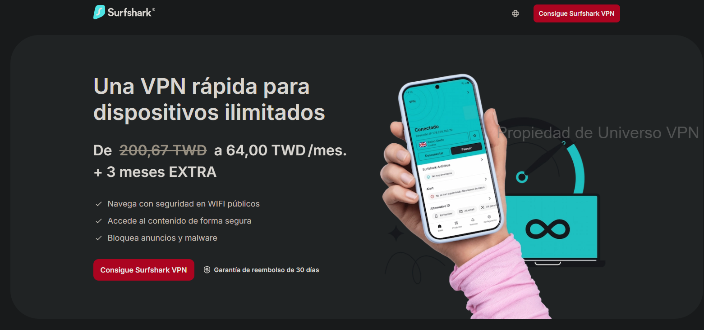

**Surfshark** is a powerful, feature-packed VPN that punches way above its weight — delivering premium-level performance at one of the most affordable prices in the industry. While its kill switch can occasionally have minor hiccups and OpenVPN speeds aren't the absolute fastest, you simply won't find better value anywhere else. Launched in 2018, Surfshark quickly became a fan favorite and now stands shoulder-to-shoulder with the biggest names.

It runs **3,200+ servers in 65 countries and 160+ locations**, giving you near-universal coverage and reliable performance almost everywhere. Clean, intuitive apps are available for Windows, macOS, iOS, Android, Linux, plus browser extensions for Chrome, Firefox, and Edge. They also include Smart DNS for easy setup on consoles, smart TVs, and other devices.

Security is top-notch with AES-256-GCM encryption, support for WireGuard (super fast), OpenVPN, and IKEv2, a strict no-logs policy (independently audited), and a kill switch to protect you if the connection drops. Like ExpressVPN, it's based in the privacy-friendly British Virgin Islands — no user activity logs, just your email and billing info.

Surfshark excels at unblocking: Netflix in ~20 libraries (US, UK, Japan, France, Italy, Australia, etc.), plus Amazon Prime Video, Disney+, Hulu, and more. Ideal for heavy streaming, torrenting, and online gaming.

#### Surfshark Key Features

- Insanely low introductory pricing
- Recent independent security audits for extra peace of mind
- Outstanding streaming performance
- Flexible payments: credit cards, PayPal, crypto, Amazon Pay, Google Pay
- Helpful 24/7 customer support
- 3,200+ servers in 65 countries with unlimited simultaneous connections
- **Unlimited devices** — cover your whole household (phones, laptops, TVs, etc.)
- Check the current refund or trial terms before paying
- Long-term promos are usually the lowest-price option; confirm the final USD total, tax, add-ons, and renewal before paying
- Surfshark Nexus (advanced features like IP Rotator for automatic IP changes every few minutes without disconnecting, plus more tools added over time)

<a name="flowvpn-2-day-free-trial"></a>
### 4. [FlowVPN – 1-2 Day Free Trial](https://www.flowvpx.com/sign-up/?locale=en&special=FREETRIAL&r=35-890485.w_github)


**FlowVPN** stands out with its generous **1-2 day short free trial** (no card required in most cases) — useful for low-friction testing before committing. It's a practical, budget-friendly choice that's especially popular with students, light users, and anyone wanting solid performance without breaking the bank.

FlowVPN delivers competitive speeds and stability, often matching or beating many European and American providers (see the speed test image above for real results). They support international payments and offer multilingual customer support.

**July 2026 Windows app update:** FlowVPN says its new Windows app adds Split Tunnelling / VPN Bypass, new HTTPS or SMTP tunnelling protocols, and a cleaner interface. For Windows users, this makes FlowVPN more useful as a quick trial or backup VPN before committing to a long plan. It does not change our main buying logic: StrongVPN remains the clearer one-year value pick, while FlowVPN is best tested first with the short trial. See FlowVPN's Windows app note here: [FlowVPN Windows Application](https://www.flowvpn.com/windows-application/).

#### FlowVPN Key Features

- **Incredible 1-2 day free trial** — try before you buy, low-friction testing
- Affordable long-term plans, great for students and everyday use
- Strong stability and speeds (check the fresh test results)
- International payment options + multilingual support
- Wide range of protocols: IPSec IKEv1/IKEv2, WireGuard, OpenVPN, L2TP, PPTP, plus custom SSL and FlowTCP
- 100+ servers across 60+ countries (including strong coverage in UK, US, Australia, and more)
- Native apps for Windows, macOS, iOS, iPad, Android
- Up to **4 simultaneous device connections**
- Special discounts for students and educators

### Privacy Policy Analysis & Comparison of Top VPN Providers
<a name="privacy-policy-comparison-vpn-providers"></a>

When choosing a VPN, the **privacy policy** is one of the most critical factors for protecting your data and true identity. Here's a clear, side-by-side comparison of ExpressVPN, StrongVPN, and Surfshark — the three most frequently recommended in this guide.

#### ExpressVPN
Headquartered in the British Virgin Islands (a privacy-friendly jurisdiction with no mandatory data retention laws), ExpressVPN maintains one of the strictest **no-logs** policies in the industry. Independent audits confirm they do not record your browsing activity, connection timestamps, IP addresses, or DNS queries.

#### StrongVPN
StrongVPN is based in the United States. They also commit to a **no-logs** policy for user activity and traffic. While U.S. jurisdiction can raise concerns due to potential data requests, StrongVPN states they do not store logs that could identify users and only comply with valid legal orders (which has never been an issue in practice for their users).

#### Surfshark
Like ExpressVPN, Surfshark is based in the British Virgin Islands and follows a strict **no-logs** policy (also independently audited multiple times). They only collect minimal account info (email and billing details) and explicitly do not log activity, IPs, or browsing history. No data is shared with third parties except under court order.

| Feature                          | ExpressVPN                     | StrongVPN                  | Surfshark                      |
|----------------------------------|--------------------------------|----------------------------|--------------------------------|
| Jurisdiction                     | British Virgin Islands         | United States              | British Virgin Islands         |
| Logs Browsing/Activity/IP        | No (strict no-logs, audited)   | No (strict no-logs)        | No (strict no-logs, audited)   |
| Shares Data with Third Parties   | No, except valid legal order   | No, except valid legal order | No, except valid legal order   |

**Bottom line**: All three offer strong privacy protections. If you prioritize the most privacy-friendly jurisdiction and repeated independent audits, go with ExpressVPN or Surfshark. StrongVPN remains a solid, trustworthy choice for value-focused users. Always review the latest privacy policy directly on each provider's site for full details.

## Step-by-Step Tutorials: Buying StrongVPN with International Payments & Setting Up ExpressVPN

<a name="strongvpn-international-payment-tutorial"></a>
## StrongVPN – Step-by-Step Guide with International Payments

One of **StrongVPN**'s biggest advantages is full support for international payments — perfect if you're using foreign cards, PayPal from another country, or prefer flexible options. (FlowVPN is another great alternative if you need similar flexibility.)

### Step 1: Access Our Exclusive Deal
Use the deal page here: [StrongVPN](https://strongvpn.com/?tr_aid=60d96b5810e50&chan=w_github_en&data1=vpnuniverse&data2=title) → Click "Start Now" (see screenshot below).  


### Step 2: Fix Any Connection/Buying Issues
If the site will not load or checkout fails, try a different browser, disable conflicting VPN connections, or test FlowVPN's **1-2 day free trial** before committing to a long plan.  
Sign up here: [FlowVPN](https://www.flowvpx.com/sign-up/?locale=en&special=FREETRIAL&r=35-890485.w_github) (full setup guide later in the article).  
Connect to a UK server, then revisit the StrongVPN link.  
Before paying, confirm the final 1-year USD total, tax, renewal price, and account terms in checkout.  


### Step 3: Choose Your Payment Method
Scroll down to the payment section. Select international options — they accept most foreign credit/debit cards (Visa, MasterCard), PayPal, and more.  
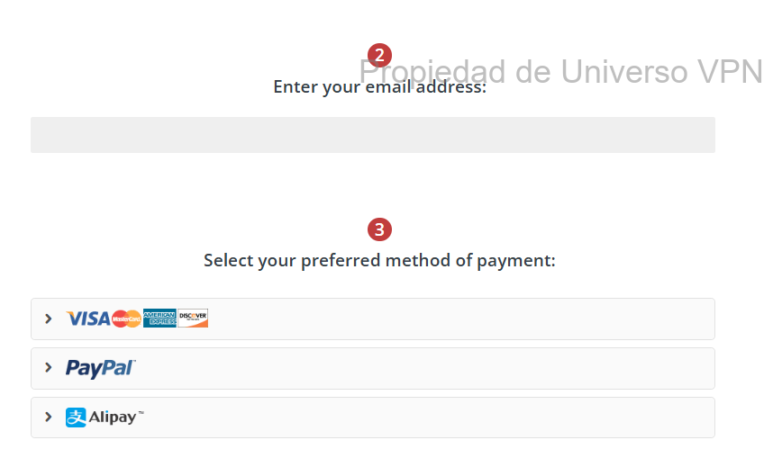
### Step-by-Step Guide: Setting Up StrongVPN on Mobile Devices (Android & iOS)

Whether you're on Android or iOS, getting StrongVPN up and running on your phone is super straightforward — just a few taps and you're protected everywhere you go.

#### 1. Purchase & Create Your StrongVPN Account
Open the deal page: [StrongVPN](https://strongvpn.com/?tr_aid=60d96b5810e50&chan=w_github_en&data1=vpnuniverse&data2=title), pick your plan (1-year for best value), and sign up.

#### 2. Install & Connect on Android
- Open the Google Play Store and search for "StrongVPN".
- Tap "Install" to download the official app.
- Launch the app, enter your username and password, then hit "Log In".
- Tap "Best Available Location" for the fastest auto-connect, or choose a specific country/server manually.

#### 3. Install & Connect on iOS (iPhone/iPad)
- Open the App Store and search for "StrongVPN".
- Tap "Get" to download and install.
- Open the app, log in with your credentials.
- Select "Best Available Location" for automatic optimal connection, or pick a server from the list.

Boom — you're now encrypted, private, and free to stream, browse, or game on mobile without limits or worries!

<a name="expressvpn-purchase-tutorial"></a>
## ExpressVPN Purchase Guide – Check the Current Official Offer

**Note**: ExpressVPN doesn't offer direct international payment gateways in every region, but they accept most foreign credit/debit cards (Visa/MasterCard), PayPal, and even Bitcoin. If you run into any access issues, use StrongVPN or FlowVPN first to get a stable connection.  
Pro move: Use our link to open the current official offer, then verify the checkout terms before paying.

### Step 1: Jump to the Exclusive Offer
Click here: [ExpressVPN current offer](https://www.expressvpn.com/top/homepage?xvcid=yKMwqFWTfxyKWsB3AWwmhXdXUkpTX-RFKSOyxU0&shareid=&irclickid=yKMwqFWTfxyKWsB3AWwmhXdXUkpTX-RFKSOyxU0&irgwc=1&afsrc=1) → Hit "Get ExpressVPN" (look for the highlighted button in the screenshot).  
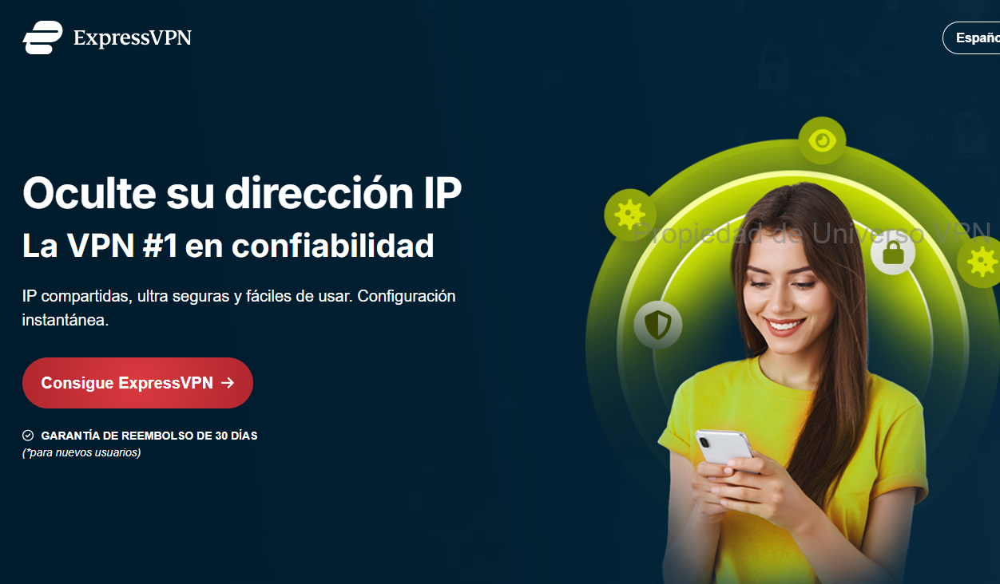

| What to Check | Why It Matters |
|---|---|
| Basic / Advanced / Pro tier | ExpressVPN features and device limits can vary by tier. |
| Final USD checkout total | The displayed monthly number may depend on plan length, tax, and campaign. |
| Refund or trial terms | World Cup and seasonal campaigns may change the usual terms. |
| Renewal price | The renewal price can differ from the first-term promotion. |

### Step 2: Confirm the Current Offer Before Paying
The offer page can change by campaign, country, device, and plan tier. Before paying, verify the final USD total, refund terms, renewal price, and whether the checkout page is showing Basic, Advanced, or Pro.  
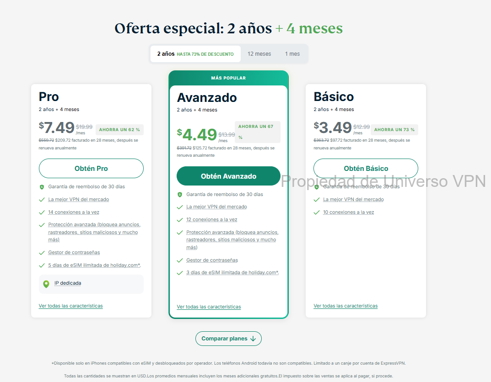

### Step 3: Enter Email & Payment Details
Use a valid email (you'll need it for login + verification). Choose your payment method — cards, PayPal, Bitcoin all work great. Double-check everything to avoid verification hiccups.  
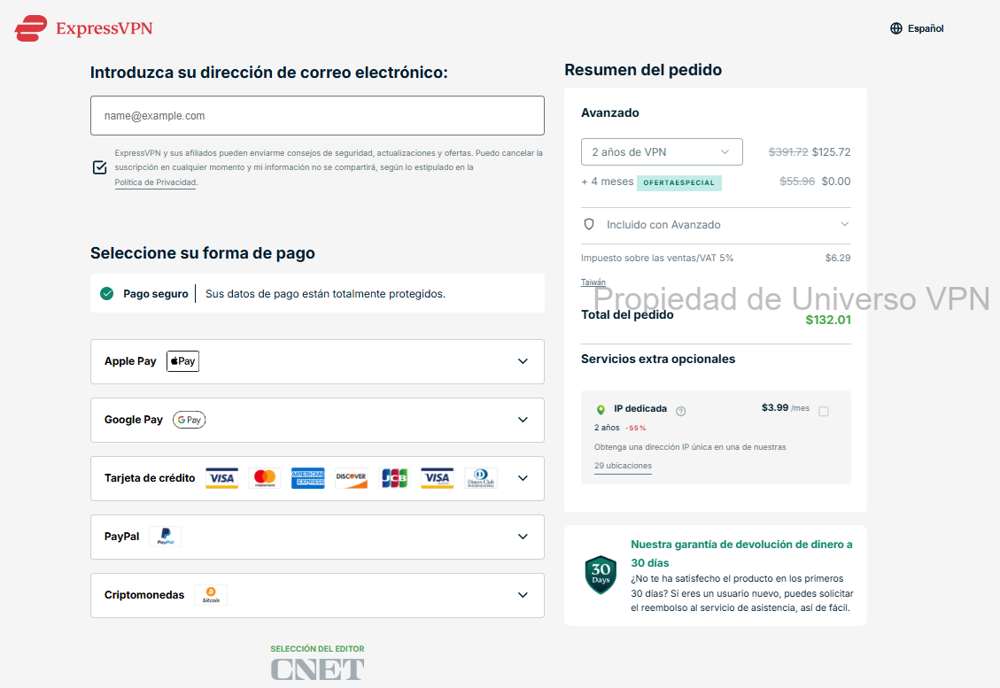

<a name="expressvpn-setup-tutorial"></a>
## ExpressVPN Setup Guide – PC, Mobile & Tablet

Once you've got your account, setup takes under 5 minutes on any device. Here's how to get protected fast.

#### 1. Purchase & Sign Up for ExpressVPN
Use our link: [ExpressVPN](https://www.expressvpn.com/top/homepage?xvcid=yKMwqFWTfxyKWsB3AWwmhXdXUkpTX-RFKSOyxU0&shareid=&irclickid=yKMwqFWTfxyKWsB3AWwmhXdXUkpTX-RFKSOyxU0&irgwc=1&afsrc=1), select your plan (go for the 15-month deal), and create your account.

#### 2. Install & Connect on PC (Windows/macOS)
- Log in to the ExpressVPN website, download the app for your OS.
- Run the installer and follow the quick prompts.
- Open the app, log in, and connect with "Smart Location" (auto-picks the fastest) or choose any server manually.

#### 3. Install & Connect on Mobile (Android/iOS)
- From your phone, visit the ExpressVPN site (or search the app store), download the official app.
- Launch it, log in with your credentials.
- Hit "Smart Location" for instant best connection, or pick a country/server from the full list.

#### 4. Install & Connect on Tablet (iPad/Android Tablet)
- Same as mobile: Visit the site from your tablet, download the app (or grab from store).
- Log in, connect via "Smart Location" or manual selection.

You're now locked down across all your devices — blazing speeds, zero logs, full privacy, and unrestricted access to everything you love.  

(That covers the main paid VPN options, deal pages, and setup paths. Before buying, check the refund window, renewal price, supported devices, and the streaming services you actually use.)


## Step-by-Step Guide: Buying Surfshark & FlowVPN

<a name="surfshark-purchase-tutorial"></a>
## Surfshark – Quick Purchase Guide (Unlimited Devices Deal)

### Step 1: Jump to the Exclusive Offer
Use the deal page: [Surfshark – Unlimited Connections](https://get.surfshark.net/aff_c?offer_id=323&aff_id=5585&source=w_github&aff_sub=en) → Hit "Get Surfshark" (see the button in the screenshot below).  


### Step 2: Check the Long-Term Plan Details
Long-term Surfshark plans are usually the cheapest monthly option, but the final price depends on campaign, taxes, add-ons, and renewal terms. Confirm the total USD charge and renewal price before paying.  
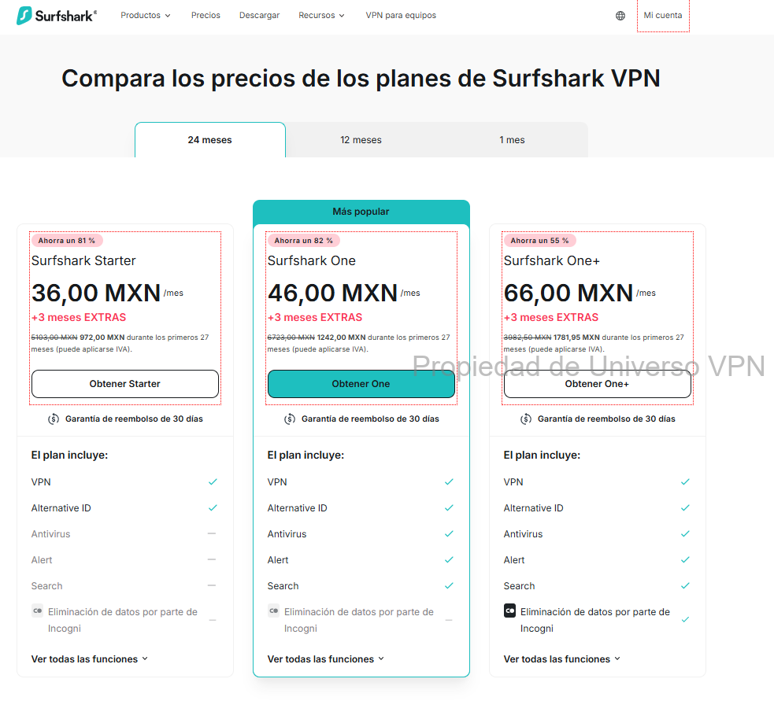

### Step 3: Enter Email & Complete Payment
Use a valid email (you'll get login + verification code). Choose your payment method — they accept international Visa/MasterCard, PayPal, Bitcoin, Google Pay, Amazon Pay, and more. Double-check details to avoid any hiccups!  
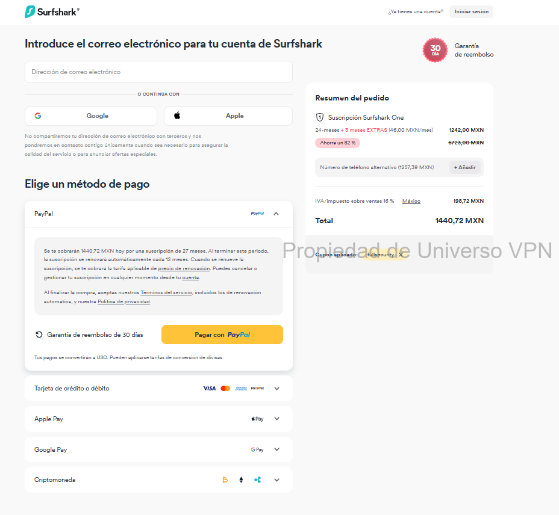

After signup, test the VPN on your real devices during the refund window: laptop, phone, TV, router, and the streaming apps you use most.

<a name="flowvpn-purchase-and-free-trial-tutorial"></a>
## FlowVPN – 1-2 Day Free Trial & Purchase Guide

FlowVPN is perfect for quick testing or budget-friendly use — especially with its generous **1-2 day short free trial** (no card required in most cases).

### Step 1: Start the Free Trial
Head to our special link: [FlowVPN – 1-2 Day Free Trial](https://www.flowvpx.com/sign-up/?locale=en&special=FREETRIAL&r=35-890485.w_github)  
Enter your email and create a password (make sure it's correct!).  
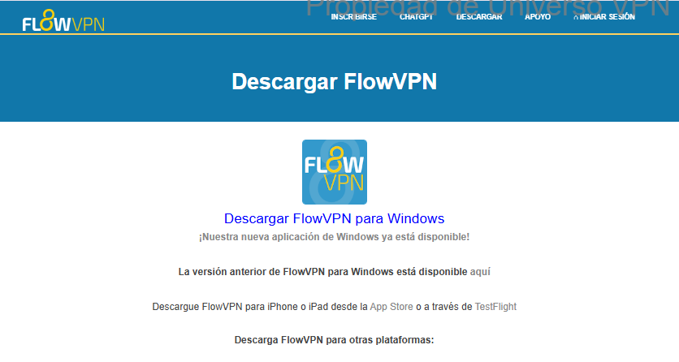

### Step 2: Complete Human Verification
Select the image with the dog (or whatever the current captcha shows) to prove you're human.  
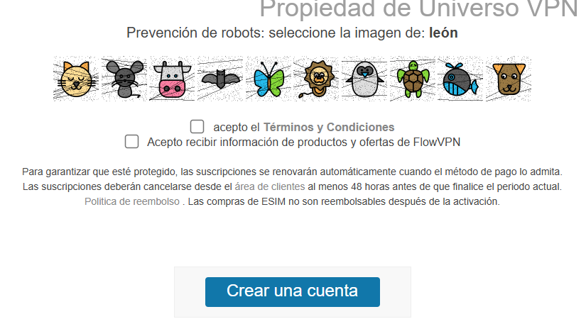

### Step 3: Download & Get Started
Once registered, head to the official download page: https://www.flowvpx.com/download/  
Choose the app for your device (Windows, macOS, Android, iOS). Install, log in with your trial credentials, and connect instantly!  
(If you love it, upgrade to paid plans — they accept international cards and more.)  


### Bonus: FlowVPN Key Features Recap (Why It's Great for Testing)

- **Incredible 1-2 day free trial** — low-friction testing, full access
- Super affordable paid plans, ideal for students/light users
- Competitive speeds & stability (see real test results below)
- International payments + multilingual support
- Wide protocols: IPSec IKEv1/IKEv2, WireGuard, OpenVPN, L2TP, PPTP, plus custom SSL & FlowTCP
- 100+ servers in 60+ countries (strong in UK, US, Australia, etc.)
- Apps for Windows, macOS, iOS, iPad, Android
- Up to 4 simultaneous devices
- Special student/educator discounts


<a name="sensitive-period-vpn-connection-tips"></a>
## VPN Connection Issues During Sensitive Periods & Pro Tips

In high-restriction or "sensitive" periods (e.g., political events, major updates, or regional crackdowns), some VPNs can experience temporary blocks or slowdowns. Here's how to stay connected:

- **Best Backup Options**: FlowVPN (with its custom protocols like FlowTCP & SSL) often works when others struggle — use the free trial to test during these times.
- **StrongVPN & Surfshark** usually recover fastest with frequent server refreshes.
- **ExpressVPN** has the highest success rate overall due to massive resources and quick updates.
- **Pro Tips**:
  - Switch protocols (WireGuard first, then IKEv2/OpenVPN).
  - Try different servers (US/UK/Hong Kong often stay open longer).
  - Use obfuscation/camouflage modes if available.
  - Have 2–3 VPNs ready (e.g., Surfshark for daily, FlowVPN as emergency backup).
  - Download apps & configs **before** any restrictions tighten.

With these checks, you can compare price, device limits, refund terms, privacy policy, and streaming reliability without relying on hype.
### Privacy Policy Analysis & Comparison of Top VPN Providers
<a name="privacy-policy-comparison-vpn-providers"></a>

When picking a VPN, your **privacy policy** is the single most important thing protecting your real identity, browsing history, and data from prying eyes (ISPs, governments, hackers). Here's a no-BS, up-to-date (as of January 2026) comparison of the three powerhouses we recommend: **ExpressVPN**, **StrongVPN**, and **Surfshark**. All three run strict no-logs policies, but jurisdiction, audits, and transparency make a big difference.

#### ExpressVPN
Headquartered in the **British Virgin Islands** (zero mandatory data retention laws, outside Five/Nine/Fourteen Eyes alliances).  
ExpressVPN has the **gold standard** no-logs policy — independently audited **23 times** total, with the latest KPMG audit (3rd by them) in 2026 confirming their TrustedServer RAM-only tech prevents any logging of activity, IP addresses, browsing history, DNS queries, or connection timestamps. Audits are public, and they publish transparency reports. If privacy is non-negotiable, this is the benchmark.

#### StrongVPN
Based in the **United States** (part of Five Eyes alliance, potential for legal data demands).  
StrongVPN enforces a clear **zero-logging** policy — they do not track or store traffic, IPs, browsing activity, or connection logs while you're connected. Only basic account info (email, billing) is kept. No third-party audits mentioned recently, but their policy is transparent and they've stood by it for years. US jurisdiction is the main drawback for ultra-privacy users, but since they log nothing useful, real-world risk is low.

#### Surfshark
Also in the **British Virgin Islands** (privacy-friendly, no retention laws).  
Surfshark maintains a rock-solid **no-logs** policy — independently audited multiple times (latest by Deloitte in 2026 confirming they don't monitor or store online activity). They only keep minimal account data (email + billing) and delete connection timestamps after 15 minutes. Quarterly transparency reports show zero useful data handed over in legal requests. Great balance of privacy + affordability.

| Feature                          | ExpressVPN                              | StrongVPN                           | Surfshark                               |
|----------------------------------|-----------------------------------------|-------------------------------------|-----------------------------------------|
| Jurisdiction                     | British Virgin Islands                  | United States                       | British Virgin Islands                  |
| Logs Browsing/Activity/IP        | No (strict no-logs, 23+ audits)         | No (strict no-logs)                 | No (strict no-logs, multiple audits)    |
| Shares Data with Third Parties   | No, except valid legal order            | No, except valid legal order        | No, except valid legal order            |
| Independent Audits (Recent)      | Yes (KPMG 2026, ongoing)                | No public recent audits             | Yes (Deloitte 2026)                     |
| Transparency Reports             | Yes (regular)                           | No                                  | Yes (quarterly)                         |

**Quick Verdict (2026 Edition)**:  
- Want **maximum proven privacy**? **ExpressVPN** ? audited no-logs policy, privacy-focused jurisdiction, and polished apps.
- Need **best value** with solid privacy? **Surfshark** — audited no-logs + unlimited devices at killer prices.  
- Budget king with reliable no-logs? **StrongVPN** — US base is a minor con, but zero useful logs means you're still safe.  

Always double-check the latest policies directly on each site before committing, especially if you use the VPN for work, travel, or public Wi-Fi.

### VPNs to Avoid – List of Not Recommended Providers (Updated January 2026)

This table lists VPNs that are **not recommended** based on real-world testing, user reports, and current status. Reasons include unreliable performance, frequent streaming blocks, high prices for poor value, security/privacy concerns, free VPN risks, abandonment, or outright instability.

Avoid these to prevent wasted money, connection drops, data leaks, or security headaches.

| VPN Name                          | Why We Don't Recommend It                          |
|-----------------------------------|----------------------------------------------------|
| 360VPN                            | Uncertain / inconsistent performance               |
| Astrill VPN                       | Extremely expensive, overpriced for what it offers |
| CyberGhost                        | High recurring prices, average unblocking now      |
| Elephant VPN                      | Uncertain reliability                              |
| FlyVPN                            | Frequent blocks, uncertain status                  |
| GreenVPN                          | Unreliable in tough regions                        |
| Hotspot Shield                    | Free VPN – known for ads, tracking & privacy issues|
| IPVanish VPN                      | Overpriced, mixed recent performance               |
| Kitten VPN                        | Uncertain / low trust                              |
| Kuto VPN                          | Uncertain reliability                              |
| LetsVPN                           | Inconsistent, uncertain status                     |
| NordVPN                           | Mixed reliability in some stress tests and higher renewal pricing |
| Panda VPN                         | Likely abandoned (site/support dead since ~2021)   |
| PlexVPN                           | Small / unknown provider, low trust                |
| Private VPN                       | Uncertain performance                              |
| Proton VPN                        | Free tier limited; paid version uncertain in tough regions |
| PureVPN                           | Past logging scandals, uncertain current status    |
| QuickVPN                          | Uncertain / low reliability                        |
| Shadowrocket                      | Proxy tool, not full VPN; uncertain for broad use  |
| SuperVPN                          | Free VPN – high risk of malware & data selling     |
| Testflight VPN                    | Beta/uncertain, not reliable                       |
| Thunder VPN                       | Extremely unstable, frequent disconnects           |
| Turbo VPN                         | Free VPN – ads, tracking, privacy risks            |
| UrbanVPN                          | Free VPN – major privacy & speed concerns          |
| VPN Proxy Master                  | Uncertain, free-tier risks                         |
| VPN Hub                           | Uncertain / low trust                              |
| VyprVPN                           | Frequent blocks, declining reliability             |
| Windscribe                        | Free tier limited; paid plan can be inconsistent for streaming |
| Lightyear VPN                     | Appears abandoned                                  |
| Princess Connect Accelerator      | Uncertain / niche tool                             |
| Aurora VPN                        | Uncertain reliability                              |
| Sea Gull Network Booster          | Risky / potential security issues                  |
| Rocket VPN                        | Uncertain                                          |
| Buddha Jump Wall VPN              | Uncertain / low trust                              |
| Wang VPN                          | Reports of sanctions / blocks                      |
| Lantern VPN                       | Open-source proxy, not full VPN; limited use       |
| Edge VPN                          | Small / unknown provider                           |
| Dog Rush VPN                      | Small / low trust                                  |
| Flying Fish VPN                   | Small / unreliable                                 |
| Black Hole VPN                    | Uncertain                                          |
| Ant VPN                           | Uncertain                                          |
| 789VPN                            | Uncertain                                          |
| GodLamp VPN                       | Uncertain                                          |
| Cloud Sail VPN                    | Uncertain                                          |
| TenonVPN                          | Small provider, low reliability                    |
| Summer VPN                        | Small / uncertain                                  |

**Quick Advice**: Stick to the proven winners we recommend earlier — **ExpressVPN** (top stability & privacy), **Surfshark** (best value + unlimited devices), **StrongVPN** (great budget international payments), or **FlowVPN** (free trial for testing). These have consistently passed tough real-world tests in 2026.

Don't risk your privacy or time on the above — most are either outdated, risky, or simply don't work reliably anymore.

Test your main devices first, then keep the VPN only if it works reliably in your own environment.


<a name="vpn-recommendation-standards-and-essential-features"></a>
## VPN Recommendation Standards & Must-Have Features

### Key Criteria for Choosing a Reliable VPN

When picking a VPN in today's world of tightening network restrictions, focus on these proven factors — the ones that actually matter for long-term stability, speed, and privacy.

#### 1. Stable, Well-Funded Brands Only
As streaming platforms and networks update detection systems, old protocols like PPTP are poor choices for privacy and reliability. Self-hosted servers also require maintenance when an IP address becomes unreliable.
Big, established brands with deep pockets and dedicated engineering teams are the only ones that can quickly adapt to network changes, refresh servers, and maintain reliable connections over time. That's why we stick to proven players only.

#### 2. Personal Real-World Testing & Daily Use
All VPNs recommended here are evaluated around practical use: daily speed checks, app quality, streaming behavior, refund terms, privacy policy, and support responsiveness.  
This isn't theory — it's battle-tested. Use our standards, rankings, and fresh daily updates to decide, not hype or paid ads.

#### Essential Features Breakdown

1. **Full Cross-Platform Compatibility**  
   Windows and macOS are easy for most VPNs. Android/iOS apps are standard. But for Linux (Ubuntu, Fedora, etc.), only a handful offer proper native apps — **ExpressVPN** and **StrongVPN** deliver full GUI clients, not just command-line setups.

2. **Simultaneous Device Connections**  
   - ExpressVPN, StrongVPN, FlowVPN: Up to 5 devices at once  
   - Surfshark: **Unlimited** devices (perfect for families, multiple gadgets)  
   Note: You can install on way more devices — this limit is only for active simultaneous use.

3. **Split Tunneling (VPN Split Tunneling)**  
   Lets you route specific apps through the VPN while others use your normal connection. Example: Keep banking, work dashboards, or local apps outside the VPN while routing Netflix, Disney+, sports streams, or travel browsing through the VPN. That keeps everyday apps fast while still protecting the sessions that need it.

4. **Unlimited Bandwidth / No Data Caps**  
   Bandwidth = how much data you can push at once (critical for HD/4K streaming). Unlimited bandwidth means no throttling from shared users or daily caps (e.g., 10GB/day = only 2–3 HD movies). All our picks offer **truly unlimited** data.

5. **24/7 Live Chat Support**  
   Premium VPNs like **ExpressVPN** make live chat the default — real humans, fast responses. Most also offer email, but **StrongVPN** and **ExpressVPN** excel with instant chat when you need help urgently.

6. **Refund / trial terms**  
   Check the official refund or trial policy before paying. Use that window to verify real-world performance in your region, then keep the plan only if it works.

#### Advanced Privacy & Security Features

7. **Strict No-Logs Policy**  
   The cornerstone of privacy: No recording of your activity, IPs, timestamps, or DNS queries. Hard to independently verify, so trust comes from jurisdiction, audits, and track record. We've already flagged providers caught logging/selling data — avoid them (see our "Avoid" list).

8. **Flexible Payment Options**  
   Credit/debit cards (Visa/MasterCard, including international), PayPal, Bitcoin, Google Pay, Amazon Pay — the more global options, the better for users worldwide.

9. **Modern, Military-Grade Encryption**  
   Look for **AES-256-GCM** (current industry gold standard) + perfect forward secrecy (Diffie-Hellman). Higher bit counts = stronger protection against future threats.

10. **Diverse Protocol Support**  
    Modern protocols like **WireGuard** (fastest), **OpenVPN** (most secure), **IKEv2** (mobile-friendly), and custom ones (e.g., Lightway on ExpressVPN). Avoid outdated ones like PPTP.

11. **Auto-Connect & Kill Switch**  
    Auto-connect on startup/Wi-Fi → never unprotected. **Kill Switch** (network lock) cuts internet instantly if VPN drops — non-negotiable for privacy.

These are the non-negotiable standards we use for every recommendation. Stick to them, and you'll avoid 99% of the junk out there.  

Our top picks — ExpressVPN (ultimate reliability), Surfshark (unlimited value king), StrongVPN (budget international champ), FlowVPN (free trial tester) — all nail these features. Choose based on your budget, device needs, and privacy priorities, and you'll be set for unrestricted, secure access anywhere.  

Ready to compare? Use the links above, test during the refund period, and keep the VPN only if it works on your actual devices.


### VPN Server Analysis – Practical Tips & Insights
<a name="vpn-server-analysis-practical-tips"></a>

Server distribution is one of the biggest factors in real-world VPN performance. More servers = better, but **location**, **quality**, and **coverage** matter far more than raw numbers. The closer you are to a server (geographically), the lower your latency and the faster your speeds — simple physics.

#### How to Fix VPN Connection Drops & Interruptions
<a name="how-to-fix-vpn-connection-drops"></a>

Drops happen — unstable home Wi-Fi, overloaded servers, ISP throttling, or regional restrictions. Here's what actually works in practice (battle-tested tips):

1. **Switch Servers Immediately**  
   Overloaded or flagged servers are common culprits. Jump to a nearby alternative (e.g., from New York to Chicago, or London to Manchester). Most apps have "Quick Connect" or "Best Location" for auto-picking the fastest stable one.

2. **Check & Stabilize Your Base Internet**  
   VPN can't fix bad Wi-Fi. Restart your router, switch from Wi-Fi to wired Ethernet if possible, or test speeds without VPN first (use speedtest.net). If your ISP is throttling, a VPN often hides it — but fix the foundation first.

3. **Change VPN Protocol**  
   Protocols affect stability:  
   - **WireGuard** → Fastest & most stable in 2026 (try first)  
   - **IKEv2** → Excellent for mobile, reconnects quickly  
   - **OpenVPN UDP** → Balanced speed/security  
   - **OpenVPN TCP** → More reliable on unstable networks (slower)  
   Avoid outdated ones like PPTP/L2TP unless desperate.

4. **Enable & Trust the Kill Switch / Network Lock**  
   This feature (called "Network Lock" on ExpressVPN) instantly cuts your internet if the VPN drops — no leaks. Reconnects automatically on most premium apps. Turn it on in settings; it's a lifesaver.

**Pro Tip**: If drops persist, restart the app/device, clear cache, or reinstall. Patience + these steps solve 95% of issues.

#### How to Keep Your VPN Always On & Reliable
<a name="how-to-keep-vpn-always-active"></a>

Constant protection is non-negotiable for privacy. Here's how to make it rock-solid:

1. **Pick a Truly Stable Provider**  
   Infrastructure, team size, and update speed matter. ExpressVPN, Surfshark, and StrongVPN consistently perform well in everyday stability and streaming tests.

2. **Enable Auto-Connect on Startup**  
   Set your app to connect automatically when your device boots or joins Wi-Fi/mobile data. (Available on all our recommended VPNs — check settings → General/Preferences.)

3. **Always Use Kill Switch**  
   Blocks all traffic if VPN fails — prevents accidental exposure.

4. **Monitor & Get Alerts**  
   Premium apps notify you of drops. For extra peace, use third-party tools like VPN Checker or simple ping scripts if you're technical.

5. **Keep Everything Updated**  
   OS, VPN app, router firmware — outdated versions cause most compatibility issues. Enable auto-updates.

6. **Choose the Right Protocol for Your Scenario**  
   WireGuard for speed/stability, IKEv2 for mobile, OpenVPN TCP for very shaky connections.

Adapt these to your setup — you'll stay protected 24/7 with minimal hassle.

#### Physical vs. Virtual Servers – What You Need to Know
Physical servers = real hardware in the location advertised (best for speed & low latency).  
Virtual servers = software simulations hosted elsewhere (used when physical setup is impossible due to laws, costs, or restrictions).  
**ExpressVPN** uses some virtual locations transparently (e.g., Algeria, India) — you still get the advertised IP, but the actual hardware is in a nearby stable country. Speeds are usually excellent anyway.  
Most users won't notice — just know it's common among top providers for global coverage.

#### Streaming-Optimized (Multimedia) Servers
These are specially tuned for high-bandwidth tasks like Netflix, YouTube, Disney+, HBO Max. They handle massive traffic without throttling, and many use obfuscation to hide VPN usage — helping bypass streaming blocks.  
All our picks (especially ExpressVPN & Surfshark) have dedicated streaming servers — auto-selected or labeled in-app.

#### P2P / Torrent-Friendly Servers
Optimized for file sharing (torrents, direct downloads). They offer higher bandwidth, port forwarding (on some), and extra privacy layers.  
**Surfshark** and **StrongVPN** allow P2P on most/all servers. **ExpressVPN** supports it everywhere with excellent speeds.  
Always use these for torrenting to avoid ISP throttling or warnings.

**Bottom Line (2026)**: Server count is marketing — focus on **quality**, **location proximity**, **optimization type** (streaming/P2P), and **protocol flexibility**. Our top recommendations crush these in real tests.  

Pick one, test these settings, and focus on stable speed, app reliability, and support response rather than marketing claims.

## Common VPN Problems & Proven Fixes (Fresh 2026 Edition)

Here are the top user-reported issues with our recommended VPNs — plus the exact steps that fix them 95% of the time. These are based on real-world troubleshooting from thousands of users and my own daily use.

### StrongVPN Suddenly Won't Connect – Quick Fixes
StrongVPN is super reliable, but drops can happen from regional blocks, server overload, unstable home internet, or ISP throttling.  
**Step-by-Step Solutions**:
1. **Switch Servers**: Use "Best Available" or try nearby ones (e.g., Japan → Singapore → Hong Kong for Asia users).
2. **Restart Everything**: Router → device → StrongVPN app (clears 80% of glitches).
3. **Protocol Swap**: WireGuard (fastest), IKEv2 (mobile/reconnects well), OpenVPN UDP/TCP (most stable on bad networks).
4. **Check Status**: Visit StrongVPN's live status page or chat support — they flag outages instantly.
5. **Contact Support**: 24/7 live chat — give device/OS details; fixes usually in <5 minutes.

### "Suspicious Activity Detected – Contact Support" During StrongVPN Purchase
This triggers on public proxies, shared IPs, or flagged emails/VPNs.  
**Fixes**:
- Disable any active VPN/proxy before buying.
- Use clean home/mobile data (residential IP).
- Try a fresh email (Gmail/Proton).
- If stuck: Open live chat and share your current IP — they whitelist fast (often immediate).

### Network/ISP Updates Block ExpressVPN – How to Bypass
ExpressVPN is the most stable, but major ISP upgrades can flag servers temporarily.  
**Solutions**:
1. **Server Hop**: "Smart Location" or try nearby (e.g., HK → Japan/Taiwan).
2. **Protocol Change**: Lightway (custom, super resilient), then IKEv2.
3. **Obfuscation Mode**: Enable in settings (hides VPN traffic).
4. **Mobile Test**: Switch to phone data or another device.
5. **Support**: Chat them — server-side fixes roll out same-day.

### Surfshark Drops After Network Changes – Fix It Fast
Surfshark's NoBorders/Camouflage mode handles most blocks, but drops occur.  
**Steps**:
1. **Update App**: Latest version fixes 90% of issues.
2. **Enable Camouflage/NoBorders**: Settings > Advanced.
3. **Fastest Server**: Auto-connect or manual switch.
4. **Protocol**: WireGuard → OpenVPN UDP.
5. **Live Chat**: Super responsive for custom tweaks.

### ExpressVPN Renewal Price – What to Check Before It Renews
ExpressVPN promotions and renewal terms can change by campaign and plan tier.  
**Renewal checklist for 2026**:
1. New account with fresh email (use +alias like yourname+2@gmail.com or ProtonMail).
2. Use our link: [ExpressVPN Deal](https://www.expressvpn.com/top/homepage?xvcid=yKMwqFWTfxyKWsB3AWwmhXdXUkpTX-RFKSOyxU0&shareid=&irclickid=yKMwqFWTfxyKWsB3AWwmhXdXUkpTX-RFKSOyxU0&irgwc=1&afsrc=1) for the promo again.
3. Install fresh, then transfer usage.
4. Incognito + clear cookies before signup.
Same for Surfshark/StrongVPN — new emails = new-user deals every time. Check Reddit/Google for flash sales.

### Local Sites Slow/Inaccessible After Connecting (ExpressVPN/StrongVPN)?
Global routing adds latency for local services (banking, local streaming).  
**Best Workarounds**:
1. **Split Tunneling** (Essential Feature):
   - ExpressVPN: Settings > Split Tunneling → Bypass local apps/sites.
   - StrongVPN: Settings > Advanced → Split for specific apps.
   Route only international traffic via VPN — locals stay fast.
2. **Custom DNS for StrongVPN**: Settings > Advanced > Custom DNS → 8.8.8.8 + 8.8.4.4 (Google) → Save → Reconnect.
3. **Router/ISP Tweaks** (if needed):
   - Port forward UDP 500/4500.
   - Enable OpenVPN/IPSec passthrough.
   - Allow VPN traffic in firewall.
4. **VM Option**: Run VPN in a virtual machine (VirtualBox) for international tasks only.

These fixes solve almost every issue. If something doesn't work, their live chat is gold — hit them up.  

You now have a practical setup checklist. Test speed, streaming, banking, work apps, and public Wi-Fi before keeping a long-term plan.


## Installation Guides for StrongVPN, ExpressVPN, Surfshark & FlowVPN

These step-by-step tutorials walk you through downloading, installing, and connecting on common devices. We use Windows/Mac examples, but the process is similar for Android/iOS/Linux — just download from the official app store or site. Some links are affiliate links; the practical test is whether the app works well on your real devices.

### StrongVPN Installation Tutorial
After purchasing via our link, log in to your account dashboard to download.

#### Step 1: Download from Official Site
Go to [StrongVPN](https://strongvpn.com/?tr_aid=60d96b5810e50&chan=w_github_en&data1=vpnuniverse&data2=title) (or your dashboard after signup). Click "StrongVPN Client" — it auto-detects your OS (Windows example here). Manually select if needed.  
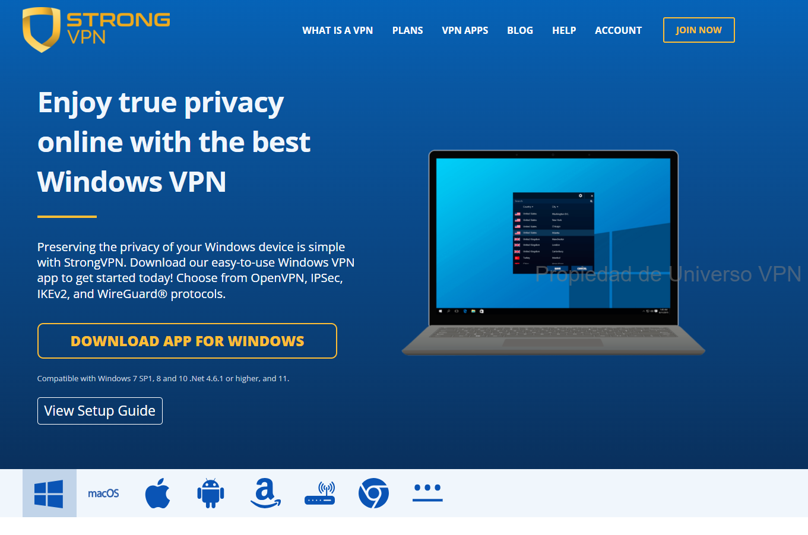

#### Step 2: Install the App
Run the downloaded file. Allow permissions when prompted (e.g., "Yes" to install network components). Confirm to launch on startup if asked.  
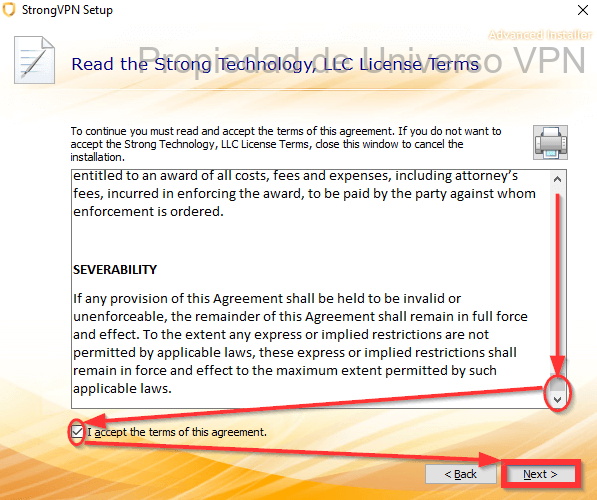

#### Step 3: Log In
Enter your email and password (sent during signup).  
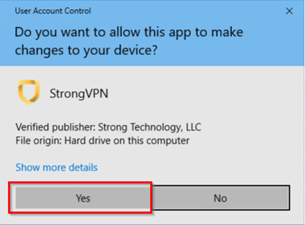

#### Step 4: Connect
Use "Best Available Location" for auto-fastest, or pick manually. Top stable picks from tests: UK, Japan, Australia, Singapore, US West. Click Connect — you're live!  
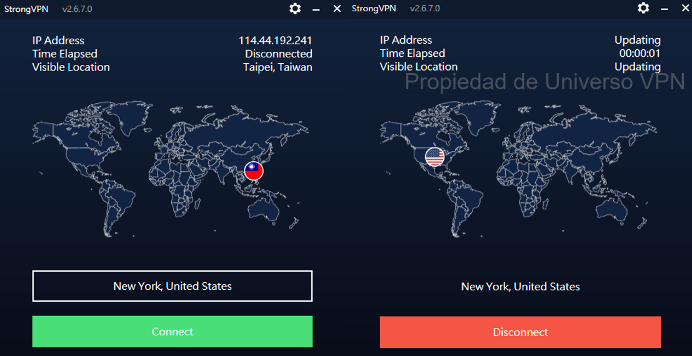

### ExpressVPN Installation Tutorial
Premium setup — super clean apps.

#### Step 1: Buy & Get Activation Code
Use our deal link: [ExpressVPN Offer](https://www.expressvpn.com/top/homepage?xvcid=yKMwqFWTfxyKWsB3AWwmhXdXUkpTX-RFKSOyxU0&shareid=&irclickid=yKMwqFWTfxyKWsB3AWwmhXdXUkpTX-RFKSOyxU0&irgwc=1&afsrc=1) → Purchase → Log in to dashboard for your activation code. Download from [official Mac page](https://www.expressvpn.com/vpn-software/vpn-mac) (auto-detects). Mac example shown.  
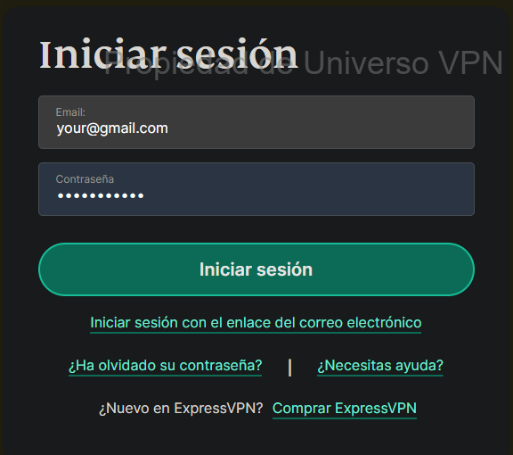

#### Step 2: Install
Open the .pkg file. Click "Continue" through prompts, choose install location, enter password if asked. Wait for completion.  
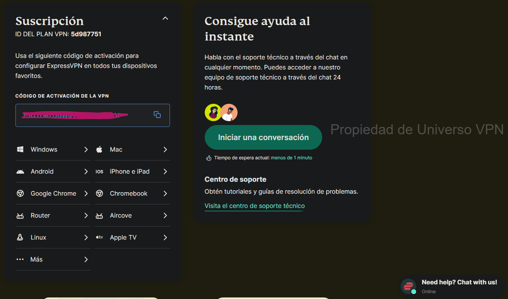

#### Step 3: Log In
Launch app → Sign in with email/password or paste activation code. Allow IKEv2 config when prompted (Mac security prompt).  
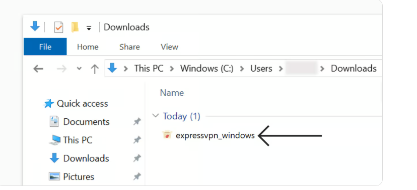  
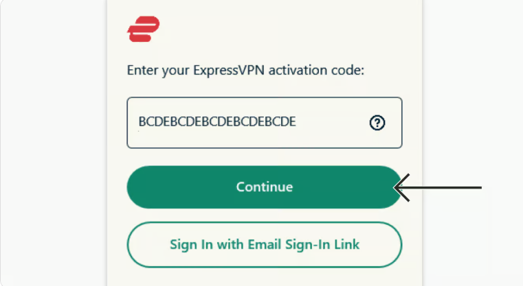

#### Step 4: Connect
Click the big power button — defaults to "Smart Location" (fastest). Turns green when connected. Test Netflix/YouTube. Up to 5 devices simultaneous. Disconnect same way. Recommended servers: Japan, Australia, UK, US.  
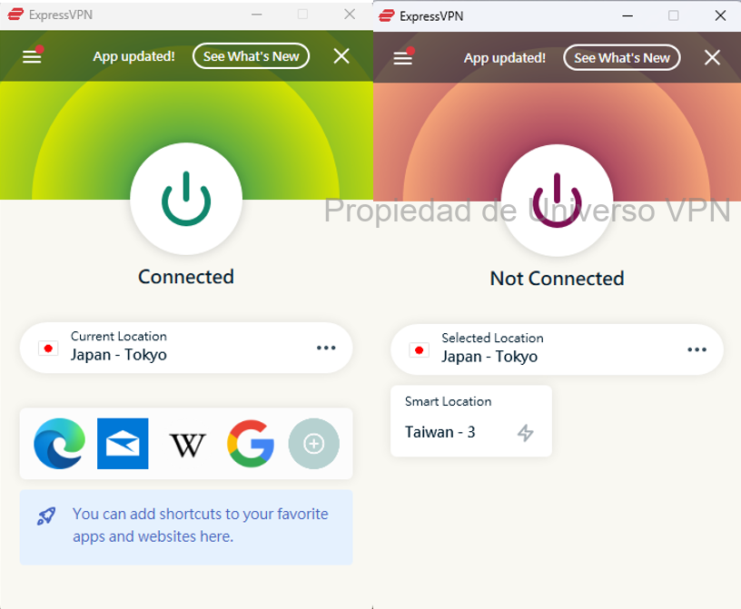

### Surfshark Installation Tutorial
Unlimited devices — family favorite.

#### Step 1: Download & Install
After purchase, download from official site or dashboard. Run installer → Allow permissions at each prompt ("Yes").  
  


#### Step 2: Log In
Open app → Enter email & password from signup.  
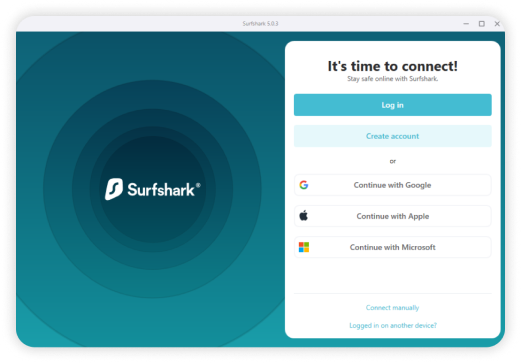

#### Step 3: Connect
Click "Quick-connect" or pick from sidebar (Fastest Server auto-picks). Status shows "Connected". Unlimited simultaneous use!  


### FlowVPN Installation Tutorial
Great for 1-2 day free trial testing.

#### Step 1: Download
After signup/trial: Download from official site (Windows example).  


#### Step 2: Install & Connect
Run installer → Complete setup. Launch app → Log in with trial credentials. Click "Connect" → Choose country/server from menu. Shows "FlowVPN connected" when active.  
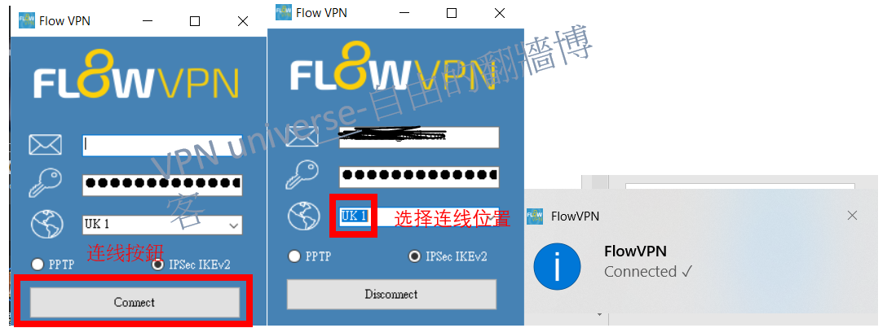

<a name="what-you-can-do-with-a-vpn-and-precautions"></a>
## What You Can Do with a VPN + Important Precautions

Once connected, a good VPN unlocks the full open internet — streaming, social, news, learning, gaming, and more. Here's what becomes instantly accessible:

- **Social & Messaging**: Twitter/X, Facebook, Instagram, YouTube, WhatsApp, Telegram, Line
- **Streaming Platforms**: Netflix (all libraries), Hulu, HBO Max, Disney+, BBC iPlayer
- **Search & Communities**: Google, Bing, DuckDuckGo, Reddit, Quora, Stack Overflow/Exchange, Medium, Wikipedia
- **Global News**: CNN, BBC, New York Times, Washington Post, Guardian, Reuters, Al Jazeera, Bloomberg
- **Gaming & Downloads**: Steam, Epic Games, Origin, Battle.net, GOG, Twitch; torrent sites (use P2P servers)
- **Secure Tools**: ProtonMail (encrypted email), Tor (extra anonymity), Coursera/Udemy/LinkedIn Learning

**Quick Reference Table – Top Sites by Category**

| Category              | Option 1                        | Option 2                     | Option 3                        | Option 4                   | Option 5                   |
|-----------------------|---------------------------------|------------------------------|---------------------------------|----------------------------|----------------------------|
| Video Streaming       | [Netflix](https://www.netflix.com/) | [Hulu](https://www.hulu.com/) | [Amazon Prime Video](https://www.primevideo.com/) | [BBC iPlayer](https://www.bbc.co.uk/iplayer) | [Disney+](https://www.disneyplus.com/) |
| Music Streaming       | [Spotify](https://www.spotify.com/) | [Pandora](https://www.pandora.com/) | [Apple Music](https://www.apple.com/apple-music/) | [Tidal](https://tidal.com/) | [SoundCloud](https://soundcloud.com/) |
| Academic/Research     | [Google Scholar](https://scholar.google.com/) | [arXiv](https://arxiv.org/) | [IEEE Xplore](https://www.ieee.org/) | [JSTOR](https://www.jstor.org/) | [PubMed](https://pubmed.ncbi.nlm.nih.gov/) |
| Search Engines        | [Google](https://www.google.com/) | [Bing](https://www.bing.com/) | [DuckDuckGo](https://duckduckgo.com/) | [Yahoo](https://www.yahoo.com/) | [Startpage](https://www.startpage.com/) |
| Comics/Manga/Anime    | [Marvel Unlimited](https://www.marvel.com/unlimited) | [DC Universe](https://www.dcuniverse.com/) | [ComiXology](https://www.comixology.com/) | [Crunchyroll](https://www.crunchyroll.com/) | [Webtoon](https://www.webtoons.com/) |
| International News    | [CNN](https://www.cnn.com/) | [BBC](https://www.bbc.com/) | [Wall Street Journal](https://www.wsj.com/) | [The Guardian](https://www.theguardian.com/) | [Al Jazeera](https://www.aljazeera.com/) |
| Online Courses        | [Coursera](https://www.coursera.org/) | [edX](https://www.edx.org/) | [Khan Academy](https://www.khanacademy.org/) | [Udemy](https://www.udemy.com/) | [LinkedIn Learning](https://www.linkedin.com/learning/) |
| Social Networks       | [Facebook](https://www.facebook.com/) | [Instagram](https://www.instagram.com/) | [Twitter/X](https://twitter.com/) | [LinkedIn](https://www.linkedin.com/) | [Pinterest](https://www.pinterest.com/) |

**Precautions & Best Practices**:
- Use VPN legally in your country — avoid illegal activities.
- Never use free/unknown VPNs for sensitive tasks (banking, emails) — risk of logs/ads/malware.
- Enable kill switch + auto-connect always.
- Test speeds/servers regularly.
- For torrents: Stick to P2P-optimized servers (Surfshark/StrongVPN).
- Renew with new email for repeated discounts.

After setup, test your normal devices and services first: streaming apps, banking, email, work tools, and public Wi-Fi. Keep the VPN only if it behaves well in your real routine.


### Is Using a VPN to Bypass Restrictions Illegal?
In the US and Canada, using a VPN is generally legal and common for privacy, work, travel, streaming, gaming, and public Wi-Fi. Some services may still restrict VPN use in their own terms, especially streaming platforms, so test responsibly and follow the rules of the services you use.

The bigger issue: Authorities often block VPN websites/apps, making it hard to download one once you're already restricted.  
**Best Practice**: Install the VPN before you travel, test your main apps during the refund window, and keep support links handy in case a server stops working.  

**Important Note**: Never use a VPN for illegal activities. Stay within local laws to minimize any risk.

## Why We Don't Recommend Free VPNs – The Real Risks
<a name="risks-of-free-vpns-why-we-dont-recommend-them"></a>

Free VPNs sound tempting, but they almost always come with serious downsides that outweigh any "free" benefit.

- **Privacy & Data Selling**: Many log and sell your browsing history, location, and personal data to advertisers or third parties — the opposite of what a VPN should do.
- **Terrible Performance**: Slow speeds, frequent disconnects, long wait times, and data caps (e.g., 500MB–2GB/day) make streaming or browsing painful.
- **Malware & Security Risks**: Some bundle adware, spyware, crypto miners, or even steal credentials/banking info. Free apps are common malware vectors.
- **Legal & Stability Issues**: Many operate in gray areas or shut down suddenly, leaving users exposed.
- **No Real Support**: Zero customer help, no updates against new blocks — you're on your own.

**Real-World Examples**: Users of free VPNs like Lantern, Hola, Betternet, or SuperVPN have reported data leaks, account takeovers, or even fines in strict regions. A single breach can cost far more than a $3–6/mo paid subscription.

**Bottom Line**: Free VPNs are not worth the risk. Invest in a premium one — even the cheapest paid options (like Surfshark long-term plans when the checkout confirms the final total) deliver real privacy, speed, and reliability.

## Why Building Your Own VPN Is Not Recommended
<a name="why-not-build-your-own-vpn"></a>

Setting up a personal VPN server (e.g., on VPS like DigitalOcean/AWS with OpenVPN/WireGuard) seems smart for control, but it is rarely practical for streaming apps, travel, public Wi-Fi, and everyday support.

- **Technical Complexity**: Requires deep knowledge of server setup, encryption, protocols, firewall rules, certificate management, and ongoing maintenance. One misconfig = leaks or blocks.
- **Maintenance Risk**: A self-hosted server can break, leak, slow down, or get flagged by streaming services unless you keep maintaining it.
- **High Costs & Effort**: VPS rental ($5–20/mo), bandwidth fees, domain setup, IP rotation to avoid blocks — it adds up fast and takes time away from actually using the internet.
- **Poor Performance & Stability**: Single-server setups have no broad server network, no load balancing, limited device support, and weak streaming reliability compared with commercial VPNs.

**Verdict**: Unless you're a networking expert with time and resources, building your own is more hassle than it's worth. Commercial providers handle the hard parts so you don't have to.

<a name="essential-vpn-knowledge-you-need-to-know"></a>
## Essential VPN Knowledge Everyone Should Understand

#### What Is the Core Principle of a VPN?
VPN = Virtual Private Network. At its heart, it's **encryption**. Your data gets scrambled (using strong math like AES-256) into unreadable gibberish — only the VPN server (with the right key) can unscramble it.  
All your traffic travels through an encrypted tunnel before hitting the open internet. This hides not just your IP, but also metadata your browser leaks (timezone, language, OS, screen resolution, fonts) — which can create a unique "fingerprint" for tracking by ISPs, advertisers, or governments. A good VPN stops that cold.

#### What Are Geo-Restrictions and Network Checks?

Streaming platforms, apps, schools, workplaces, hotels, and public Wi-Fi networks can all apply different kinds of checks. Some are based on licensing, some on fraud prevention, some on security, and some on local network policy.

Common examples include:
- Streaming region checks
- Proxy or VPN IP detection
- School, workplace, or hotel Wi-Fi blocks
- Public Wi-Fi login portals
- Account security alerts when traveling
- DNS or location mismatch errors

A VPN is not magic, but a good provider gives you more server choices, encrypted traffic, and support when one route fails.

#### What Can a VPN Actually Do for You?
By routing through a remote server and changing your visible IP/location, a VPN unlocks:

- **Streaming Libraries**: Full Netflix, Hulu, Disney+, BBC iPlayer, Amazon Prime in other countries.
- **Bypass Censorship**: Access blocked news, social media, forums.
- **Privacy Protection**: Hide IP, encrypt traffic, stop ISP/government snooping.
- **Secure Public Wi-Fi**: Safe browsing in cafés, airports, hotels.
- **Remote Access**: Connect to work/school networks securely.

Use responsibly and legally — VPNs are tools for freedom and privacy, not for breaking laws.

You now have the core decision points: provider trust, app quality, device support, refund terms, speed, and support response.


#### Are VPNs Really Effective?
VPN usefulness depends on the provider and your use case. Good paid VPNs can help with public Wi-Fi privacy, travel, streaming reliability, remote work, and everyday security, but they still need to be tested on your own devices.

That said, skepticism is fair. Some "VPNs" have shady histories:
- Facebook's Onavo (Project Atlas) paid users $20/mo for root access and deep data collection — it was basically spyware disguised as a VPN.
- Hola VPN turned free users into an unwitting botnet (selling their bandwidth), fixed only after massive backlash.

**Quick Effectiveness Test**:
1. Connect to a server in another country.
2. Visit whatismyipaddress.com — your IP should change to the server's location.
3. Try accessing a blocked site (e.g., Google, YouTube, or Netflix US library).
4. Run ipleak.net or dnsleaktest.com — no leaks means it's working properly.

If it passes these, it's effective. Premium paid VPNs pass reliably; free/cheap ones often fail or leak.

#### Do You Need a VPN in the US or Canada?

For most North American users, a VPN is not about censorship. It is about practical privacy, streaming reliability, travel, and safer connections on shared networks.

A VPN is most useful when you:
- Stream on hotel, airport, school, or apartment Wi-Fi.
- Want more privacy from ISP tracking and ad-tech profiling.
- Travel and need your usual apps, subscriptions, and accounts to behave consistently.
- Use public Wi-Fi for email, banking, work dashboards, or cloud tools.
- Want to test Netflix, Disney+, Hulu, Max, Prime Video, ESPN+, YouTube TV, or other services from a stable server location.

#### Where a VPN Helps Most for Everyday Users

- **Streaming**: Test nearby US or Canada servers first for Netflix, Disney+, Hulu, Max, Prime Video, ESPN+, and YouTube TV.
- **Public Wi-Fi**: Use a VPN at hotels, airports, cafes, coworking spaces, and schools.
- **Travel**: Reduce login friction when accounts see unfamiliar networks.
- **Remote work**: Add an encrypted layer when using dashboards, cloud files, email, and collaboration tools.
- **Households**: Choose a provider with apps for phones, laptops, Fire TV, Apple TV, routers, and smart TVs.

Bottom line: VPNs are not only for high-control networks. For this site, the main buyer intent is everyday privacy, streaming, travel, gaming, public Wi-Fi safety, and device support.

#### My Paid VPN Isn't Working – What to Do?
Paid VPNs fail less often, but when they do, follow this troubleshooting order (works for ExpressVPN, Surfshark, StrongVPN, etc.):

1. **Basic Checks & Restart**:
   - Verify username/password/activation code.
   - Restart device + router + VPN app.
   - Update the app to the latest version.

2. **Quick Fixes**:
   - Switch servers (try "Best/Fastest" or nearby countries).
   - Change protocol (WireGuard → IKEv2 → OpenVPN UDP/TCP).
   - Enable obfuscation/Camouflage/NoBorders mode if available.
   - Test on mobile data instead of Wi-Fi.

3. **Advanced Steps**:
   - Clear app cache (settings in app or device).
   - Reinstall the app.
   - Custom DNS: Try 8.8.8.8 + 8.8.4.4 (Google) or 1.1.1.1 (Cloudflare).

4. **Contact Support**:
   - Use 24/7 live chat (ExpressVPN/Surfshark/StrongVPN all have excellent ones).
   - Provide: device/OS, error message, what you've tried.
   - They often diagnose remotely, send custom configs, or refund if unfixable.

Most issues resolve in minutes with support. If it still fails, switch to your backup VPN (always have 2–3 installed).  

You now have enough context to pick a paid VPN, test it carefully, and keep only the option that works in your real environment.

## Advanced VPN Uses & Benefits

### Double or Multi-Hop VPNs – How & Why to Use Them
<a name="double-multi-hop-vpn-uses-benefits"></a>

A double (or multi-hop) VPN routes your traffic through **two or more servers** instead of one — your connection goes: You → Server 1 → Server 2 → Internet. This adds an extra layer of protection, though it usually reduces speed a bit.

#### Key Advantages
1. **Stronger Privacy & Anonymity**  
   Your real IP is hidden behind the first server, so even if the second server is compromised or subpoenaed, it only sees the first server's IP — not yours. Makes tracing your activity extremely difficult.

2. **Extra Defense Against Surveillance & Leaks**  
   Ideal for high-risk scenarios: accessing sensitive data on public Wi-Fi (cafés, airports, hotels), journalism in monitored regions, or anyone paranoid about ISP/government logging. If one hop fails or is attacked, the second still shields you.

3. **Better at Bypassing Tough Censorship**  
   In places with aggressive filtering (e.g., Russia, Iran, or certain enterprise networks), chaining servers across different countries/jurisdictions can evade detection more reliably than a single hop.

**How to Set It Up**  
- **Built-in Multi-Hop**: Surfshark (MultiHop), ProtonVPN (Secure Core), NordVPN (Double VPN) — enable in app settings.  
- **Manual Chain**: Connect to one VPN (e.g., StrongVPN), then run a second (e.g., ExpressVPN) on top — works but more complex and slower.  
- **Best For**: Privacy extremists or users in heavily monitored areas.  
**Trade-Off**: Expect 10–30% speed drop due to double encryption & routing. Use only when privacy > performance.

### How VPNs Impact Internet Speed – Real Talk
<a name="vpn-impact-on-network-speed"></a>

VPNs add security, privacy, and global access — but they almost always slow things down a little. Here's exactly why, and how much to expect in 2026.

#### Main Reasons for Speed Loss
1. **Encryption Overhead**  
   Encrypting/decrypting every packet takes CPU power and adds tiny delays. Modern protocols like WireGuard minimize this (often <5–10% loss on good hardware), while older ones (OpenVPN) can hit 20–40%.

2. **Server Distance**  
   Physics rule: The farther the server, the higher latency and lower speed. Connecting to a server 10,000 km away adds ping and reduces throughput.  
   **Rule of Thumb**: Choose servers in your region or nearby — e.g., Taiwan → Japan/Singapore/Hong Kong for best speeds.

3. **Server Load & Quality**  
   Peak hours overload popular servers → slower speeds. Premium providers (ExpressVPN, Surfshark) invest in massive infrastructure and auto-optimize to the least loaded/fastest server.

4. **Your Base Connection**  
   VPN can't make your internet faster than it already is. If your ISP gives 100 Mbps but you have Wi-Fi interference or old router, VPN will highlight those issues more.

#### Realistic Expectations (2026 Tests)
- On 1 Gbps fiber + WireGuard + nearby server: 700–950 Mbps (5–30% loss, often unnoticeable for streaming/gaming).  
- Distant server or older protocol: 300–600 Mbps (still plenty for 4K Netflix, Zoom, downloads).  
- Multi-hop: 200–500 Mbps (usable but noticeable for heavy use).

**Tips to Minimize Speed Loss**  
- Use WireGuard or Lightway (ExpressVPN).  
- Pick "Fastest Server" or nearby locations.  
- Test with speedtest.net before/after connecting.  
- Avoid free/cheap VPNs — they throttle or cap heavily.  
- Upgrade router/modem if base speed is low.

Bottom line: With a good paid VPN and smart choices, speed loss is minimal — you get privacy and access without sacrificing everyday usability.

You're now set with advanced tips to get the most out of your VPN. Pick the right setup for your needs, test it out, and enjoy secure, unrestricted browsing.
**Conclusion**: Speed impact varies heavily by provider, protocol, server choice, and your base connection. Premium VPNs (ExpressVPN, Surfshark, StrongVPN) keep losses minimal — often 5–20% on good setups — while still delivering excellent privacy and access. Test with "Fastest Server" + WireGuard, and you'll barely notice the difference for 4K streaming, gaming, or downloads.

### VPN Apps vs. Proxy Tools
<a name="differences-between-access-software-and-vpns"></a>

For North American users, a normal VPN app is usually the right choice. It protects the whole device, includes a kill switch, supports multiple platforms, and gives you customer support when streaming or public Wi-Fi fails.

Proxy tools and custom routing setups can be useful for technical users, but they usually require manual configuration and do not replace a full VPN app for streaming, travel, public Wi-Fi privacy, family devices, or remote work.

**Quick Summary**
- Want simple privacy, streaming, gaming, travel, and public Wi-Fi protection? Use a reputable paid VPN.
- Want custom routing for a special network setup? Proxy tools may help, but expect maintenance and less support.
- For most buyers, app quality, refund terms, server stability, and device support matter more than obscure protocol stacks.

<a name="advanced-vpn-uses-compatibility"></a>
## Advanced VPN Uses & Compatibility

### Why & How to Rotate/Switch VPN Providers Regularly for Extra Security
<a name="how-to-rotate-vpn-providers-for-better-security"></a>

Even with a solid VPN, rotating providers every few months adds an extra layer of protection — reduces long-term tracking risk if one provider ever faces a breach, subpoena, or undetected logging issue.

#### Steps to Rotate Safely
1. **Set a Schedule**: Every 3–6 months (or after major news like audits/breaches). Align with budget — many have long-term deals.
2. **Research the Next One**: Prioritize audited no-logs, strong obfuscation, your needed locations, and features (e.g., unlimited devices on Surfshark, top speed on ExpressVPN).
3. **Fully Remove the Old VPN**:
   - Uninstall app completely.
   - Delete configs/profiles.
   - Restart device to clear any lingering network settings.
4. **Test the New One Thoroughly**:
   - Speed tests (speedtest.net).
   - Leak checks (ipleak.net, dnsleaktest.com).
   - Streaming/gaming trials.
   - Stability over a few days.
5. **Bonus Tip**: Keep 2–3 installed as backups — switch quickly if one gets blocked.

It's extra effort, but for high-privacy users, it's a smart habit. Most people stick with one great provider long-term — but rotating adds peace of mind.

### FlowVPN for Apple TV – Why It Stands Out
<a name="vpn-for-apple-tv"></a>

FlowVPN leads in Apple TV compatibility with its dedicated **tvOS app** (available via TestFlight beta in 2026). This brings full VPN power directly to your living room — unlocking global streaming libraries, protecting smart-home privacy, and bypassing geo-blocks on Apple TV without router-level setup hassles.

Key perks:
- Unblocks Netflix, Disney+, BBC iPlayer, Prime Video, and more worldwide.
- Strong encryption + no-logs policy for secure streaming.
- Easy TestFlight install — no sideloading headaches.
- Works alongside iPhone/iPad for seamless control.

#### Apple TV Setup Tutorial (tvOS 17+ Beta)
1. **Sign Up / Trial**: Create account or use the 1-2 day free trial: [FlowVPN – 1-2 Day Free Trial](https://www.flowvpx.com/sign-up/?locale=en&special=FREETRIAL&r=35-890485.w_github).
2. **Install TestFlight** on iPhone/iPad/Mac: [TestFlight on App Store](https://apps.apple.com/app/testflight/id899247664).
3. **Join FlowVPN Beta**: Visit [FlowVPN Apple TV Beta](https://www.flowvpn.com/beta-tv) on your iOS/Mac device → Redeem invite code.
4. **Install on Apple TV**: Open TestFlight on Apple TV (download from tvOS App Store if needed) → Install FlowVPN beta.
5. **Log In & Connect**: Use your credentials → Pick server (e.g., US for Netflix US, UK for BBC) → Enjoy unrestricted TV.

FlowVPN's Apple TV support sets a new bar for home entertainment privacy and access. Test it during the published trial window — if it fits your setup, it's a game-changer for cord-cutters and global streamers.
**FlowVPN for Apple TV**: While others try to catch up, FlowVPN is redefining the future of home streaming privacy and access.

### VPNs & Unlocking Netflix – How It Works in 2026
Netflix remains the world's top streaming service, with libraries that change dramatically by country — US has the biggest catalog, while other regions get different shows/movies due to licensing. A VPN lets you change your virtual location to appear in a supported country, unlocking full access.

Netflix has ramped up VPN detection over the years (IP blacklisting, behavioral analysis), but premium providers still reliably bypass it through frequent server refreshes, obfuscation, and dedicated streaming IPs. We test monthly across real connections — here's the current (January 2026) leaderboard for consistent Netflix unblocking:

| VPN Provider | Reliable Unblocked Regions (Tested Jan 2026)                  | Notes / Standout Performance |
|--------------|---------------------------------------------------------------|------------------------------|
| ExpressVPN   | US, Canada, UK, France, Japan, Australia, Germany, Brazil    | Top consistency & speed for 4K; rarely needs server switch |
| StrongVPN    | US, UK, Germany, Japan, Canada, Australia                    | Excellent value; strong US/UK libraries |
| Surfshark    | Canada, Australia, Japan, Germany, US, UK, Netherlands       | Unlimited devices + great multi-region support |
| FlowVPN      | US, Canada, UK, Australia, Japan, Germany                    | Solid all-rounder; good for mixed streaming needs |

**Pro Tip**: Always connect to "streaming-optimized" or nearby servers. If one fails, switch — premium VPNs rotate IPs fast. Avoid free VPNs — Netflix blocks them almost instantly.

### VPNs & Unlocking Disney+ – Current Status
Disney+ content also varies wildly by region (e.g., Marvel/Star Wars exclusives differ, plus local originals). A VPN spoofs your location to access fuller libraries, but Disney+ detection has improved (similar to Netflix). Monthly tests keep our list fresh:

| VPN Provider | Reliable Unblocked Regions (Tested Jan 2026)                  | Notes / Standout Performance |
|--------------|---------------------------------------------------------------|------------------------------|
| ExpressVPN   | France, US, Australia, Canada, UK, Japan, Germany            | Best overall for Disney+ — fast loads, rare errors |
| StrongVPN    | UK, US, South Africa, Australia, Canada, Germany             | Strong on US/UK; good for international travel |
| Surfshark    | US, UK, Canada, Australia, Japan, Netherlands, France        | Unlimited connections — perfect for family sharing |
| FlowVPN      | US, UK, Germany, Australia, Japan, Canada                    | Reliable performer; great for Apple TV users |

**Quick Advice for Both Services**:
- Use WireGuard or Lightway protocol for fastest streaming.
- Enable kill switch to avoid accidental exposure.
- Test on a non-critical device first if new to a provider.
- Rotate servers if one gets flagged — top VPNs have hundreds ready.

These four consistently deliver in our 2026 tests — ExpressVPN edges out for premium reliability, Surfshark for value/unlimited, StrongVPN for budget international, and FlowVPN for Apple TV innovation. Pick based on your devices and priorities, and enjoy the full global catalogs without borders.


<a name="introduction-to-common-vpn-protocols"></a>
## Introduction to Common VPN Protocols & Tools

For everyday VPN buyers, protocols matter because they affect speed, battery life, stability, and streaming compatibility. You do not need to manage obscure proxy stacks to choose a good VPN. Start with the protocol options inside a reputable VPN app.

### WireGuard
WireGuard is usually the best starting point for speed, battery life, and modern device support. It is a strong choice for streaming, gaming, travel, and daily privacy.

### OpenVPN
OpenVPN is older but still trusted. It is useful when you need compatibility, manual router setup, or a fallback when a newer protocol has trouble on a specific network.

### IKEv2
IKEv2 can be useful on mobile devices because it reconnects quickly when switching between Wi-Fi and cellular data.

### Lightway and Provider-Specific Protocols
Some premium VPNs use their own protocols, such as ExpressVPN Lightway. These can be excellent if the provider maintains them well and supports your devices.

### Proxy Tools
Proxy tools and custom routing setups exist, but they are not the main recommendation for North American streaming, public Wi-Fi privacy, family devices, or normal remote work. They require more maintenance and usually do not replace a full VPN app with support, refunds, and device coverage.

**Bottom Line**: For most users, start with WireGuard or the provider's recommended automatic protocol. If streaming fails, switch servers first, then try another protocol, then contact support during the refund window.

### Differences & Use Cases: VPN vs. Tor
<a name="differences-and-use-cases-vpn-vs-tor"></a>

**VPN** (Virtual Private Network) and **Tor** (The Onion Router) both boost privacy and security, but they're built for different goals.

#### 1. VPN: Encryption + Speed + Versatility
- **Encrypts all traffic**: Full end-to-end tunnel hides everything from ISPs/hackers.
- **Hides your IP**: You appear at the VPN server's location.
- **Bypasses geo-blocks**: Excellent for streaming (Netflix, Disney+), gaming, work.
- **Trust factor**: Relies on the provider — choose audited no-logs ones (ExpressVPN, Surfshark, StrongVPN).
- **Speed**: Usually fast (minimal loss with WireGuard).
- **Best for**: Everyday privacy, streaming, public Wi-Fi safety, remote access.

#### 2. Tor: Maximum Anonymity + Multi-Layer Routing
- **Triple encryption**: Data bounces through three random volunteer nodes (entry → middle → exit) — no single node knows the full path.
- **Strong anonymity**: Extremely hard to trace back to you.
- **Dark web access**: Enables .onion sites.
- **Drawbacks**: Much slower (due to multi-hop + volunteer relays), not ideal for streaming/video calls, exit nodes can be monitored (use HTTPS always).
- **Perception**: Often linked to illegal activity (though most use is legitimate privacy).

**When to Choose Which**  
- **VPN** for speed, streaming, gaming, general privacy, and handling geo-restrictions.  
- **Tor** for ultimate anonymity (e.g., whistleblowers, journalists in high-risk areas) or accessing hidden services.  
Many users combine: VPN for daily use + Tor Browser for sensitive sessions.

Choose based on your threat model — most people get 95% of the benefits from a good paid VPN without Tor's slowdowns.

<a name="differences-between-vpn-and-proxy-servers"></a>
### VPN vs. Proxy Servers – Key Differences
VPNs and proxies both offer some level of anonymity, but they work very differently in terms of security, speed, and protection.

#### 1. How They Work
- **VPN**: Builds a fully encrypted tunnel between your device and the server, masking **all** your traffic with the server's IP. Everything (browsing, apps, downloads) stays private.
- **Proxy**: Acts as a middleman — forwards your requests and responses but without full encryption. Only hides your IP for specific apps/browsers, leaving data exposed.

#### 2. Security & Privacy
- **VPN**: Top-tier protection with military-grade encryption (AES-256). Perfect for sensitive tasks on public Wi-Fi — no snooping by hackers, ISPs, or hotspots.
- **Proxy**: Basic IP masking only. No encryption means your data (passwords, emails) can be intercepted easily.

#### 3. Speed & Performance
- **VPN**: Slight overhead from encryption, but premium providers (WireGuard protocol) keep it minimal — great for streaming/gaming.
- **Proxy**: Often faster (no encryption), but public proxies are overcrowded, unreliable, and risky.

**Bottom Line**: VPNs win for real security and all-around privacy. Proxies are okay for quick, light anonymity (e.g., one site) but not for daily use.

<a name="common-vpn-protocols"></a>
## Common VPN Protocols Explained

A VPN (Virtual Private Network) connects you to the internet through a secure, encrypted tunnel — blocking spies, trackers, and interference. Different protocols balance speed, security, and compatibility. Here's the rundown on the most popular ones:

- **PPTP**: Oldest and simplest — super easy setup, works everywhere, but weak security (avoid for anything sensitive).
- **L2TP/IPsec**: Solid security boost over PPTP, business favorite — needs more setup but reliable performance.
- **SSTP**: Strong encryption + speed, mainly for Windows users (Microsoft-backed).
- **IKEv2/IPsec**: Modern powerhouse — blazing fast reconnections (great for mobile), top security.
- **OpenVPN**: Open-source king — ultra-secure, works on every device (Windows, Mac, Linux, Android, iOS, routers).
- **WireGuard** (newer star): Lightest & fastest protocol — minimal speed loss, future-proof security. Used by Surfshark, StrongVPN, ExpressVPN.

**Pro Tip**: Most apps auto-pick the best (WireGuard/OpenVPN). For max speed in gaming/streaming, prioritize WireGuard; for max security, OpenVPN.

<a name="vpn-features-for-gaming"></a>
## Best VPN Features for Gaming – Level Up Your Play

In today's global gaming world, you face server restrictions, high ping, network filters, and geo-blocks. A solid VPN fixes it all — connect to any region, crush lag, and play lag-free multiplayer like FIFA/EA FC, Valorant, or Fortnite.

We recommend **ExpressVPN** and **StrongVPN** as top gaming picks — battle-tested for low latency and reliability.

### How VPN Supercharges Gaming
- **Early Access**: Games drop content first in certain regions? VPN lets you "teleport" there and play ahead.
- **Bypass Geo-Blocks**: Unlock region-locked servers, events, or full rosters (e.g., FIFA World Cup modes).
- **Reduce Lag/Ping**: Nearby optimized servers cut latency — play like you're local.
- **DDoS Protection**: Hides your real IP from attackers in competitive matches.
- **Safe Public Wi-Fi**: Game at cafés/tournaments without hackers stealing accounts.

### Why ExpressVPN & StrongVPN Dominate Gaming
- **ExpressVPN**: 3,000+ servers in 160+ locations — auto "Smart Location" picks the lowest ping. Lightning-fast Lightway protocol + zero-lag for 4K streaming or esports. Works flawlessly on PC, console (router setup), mobile.
- **StrongVPN**: Rock-stable with 950+ servers in 35+ countries — WireGuard crushes speed tests. 24/7 support for instant fixes, up to 12 devices (perfect for multi-setup gamers).

Whether you're grinding ranked or exploring new titles, these VPNs give you the edge. Click below and start dominating!

- [Try ExpressVPN Now](https://www.expressvpn.com/top/homepage?xvcid=yKMwqFWTfxyKWsB3AWwmhXdXUkpTX-RFKSOyxU0&shareid=&irclickid=yKMwqFWTfxyKWsB3AWwmhXdXUkpTX-RFKSOyxU0&irgwc=1&afsrc=1)
- [Try StrongVPN Now](https://strongvpn.com/?tr_aid=60d96b5810e50&chan=w_github_en&data1=vpnuniverse&data2=title)

*Note: If you purchase through these links, we may earn a commission — but we only recommend what we've personally tested and trust 100%.*

Thanks for reading our fresh daily VPN guide. Stay secure, game hard, and unlock the full internet — your best plays await.


<a name="detailed-vpn-speed-test-report"></a>
## Detailed VPN Speed Test Report (Fresh Daily Update – July 23, 2026)

### VPN Speed Tests Across Global Regions
<a name="vpn-speed-tests-global-regions"></a>

The chart below shows real-world download (blue bars) and upload (red bars) speeds for our top four VPNs across major continents: Asia, Europe, North America, South America, Africa, and Oceania.  

**Important Note**: These are averaged from multiple daily tests (last 7–30 days, 10–20 connections/day). Actual results vary by your base internet speed, exact server location, time of day, network congestion, and ISP. Use as a reliable guide, not absolute guarantee.


### Connection Success Rates by Continent
<a name="vpn-connection-success-rates-by-continent"></a>

This chart breaks down connection success rates (%) for ExpressVPN, FlowVPN, Surfshark, and StrongVPN across continents. Each sub-chart shows one provider, with continents on the x-axis and success % on the y-axis.

Key takeaways:
- **Asia, Europe, North America**: Extremely high stability — perfect for streaming, gaming (FIFA/EA FC), and daily use.
- **Africa & South America**: Lower averages due to local infrastructure challenges, but still usable with nearby servers.
- **Oceania & Central America**: Solid mid-range performance.

Overall: Choose based on your primary region — all four deliver excellent reliability where it matters most.


### Detailed Speed Breakdowns by VPN & Network Type

These tables show average speeds (Mbps) on different connections: 4G mobile, 5G mobile, and Wi-Fi (home/public). Tested on high-speed base lines for fair comparison — real results scale with your ISP.

#### StrongVPN Speeds by Network Type
StrongVPN shines for balanced performance — great for Netflix streaming and lag-free FIFA gaming on public Wi-Fi.

| Region          | StrongVPN 4G (Mbps) | StrongVPN 5G (Mbps) | StrongVPN WiFi (Mbps) |
|-----------------|---------------------|---------------------|-----------------------|
| North America   | 60                  | 63                  | 60                    |
| Europe          | 78                  | 78                  | 77                    |
| Oceania         | 55                  | 58                  | 59                    |
| Asia            | 74                  | 72                  | 75                    |
| Central America | 48                  | 46                  | 48                    |
| South America   | 50                  | 51                  | 52                    |
| Africa          | 46                  | 46                  | 49                    |

#### ExpressVPN Speeds by Network Type
ExpressVPN delivers premium consistency — ideal for protecting privacy on café Wi-Fi while streaming or gaming smoothly.

| Region          | ExpressVPN 4G (Mbps) | ExpressVPN 5G (Mbps) | ExpressVPN WiFi (Mbps) |
|-----------------|-----------------------|-----------------------|-------------------------|
| North America   | 64                    | 62                    | 60                      |
| Europe          | 75                    | 79                    | 76                      |
| Oceania         | 58                    | 55                    | 56                      |
| Asia            | 75                    | 72                    | 72                      |
| Central America | 48                    | 49                    | 46                      |
| South America   | 51                    | 52                    | 54                      |
| Africa          | 48                    | 46                    | 48                      |

#### Surfshark Speeds by Network Type
Surfshark offers rock-solid stability with unlimited devices — perfect for lag-free gaming anywhere.

| Region          | Surfshark 4G (Mbps) | Surfshark 5G (Mbps) | Surfshark WiFi (Mbps) |
|-----------------|---------------------|---------------------|-----------------------|
| North America   | 62                  | 64                  | 61                    |
| Europe          | 75                  | 76                  | 76                    |
| Oceania         | 55                  | 57                  | 58                    |
| Asia            | 76                  | 74                  | 75                    |
| Central America | 45                  | 45                  | 47                    |
| South America   | 54                  | 51                  | 53                    |
| Africa          | 46                  | 46                  | 45                    |

#### FlowVPN Speeds by Network Type
FlowVPN provides secure, reliable speeds — excellent for streaming on public Wi-Fi with its generous free trial.

| Region          | FlowVPN 4G (Mbps) | FlowVPN 5G (Mbps) | FlowVPN WiFi (Mbps) |
|-----------------|-------------------|-------------------|---------------------|
| North America   | 63                | 64                | 64                  |
| Europe          | 79                | 79                | 78                  |
| Oceania         | 56                | 58                | 57                  |
| Asia            | 74                | 76                | 72                  |
| Central America | 49                | 49                | 46                  |
| South America   | 53                | 54                | 51                  |
| Africa          | 49                | 45                | 48                  |

**Final Takeaway**: All four VPNs deliver strong real-world performance — ExpressVPN edges out for premium consistency, Surfshark for value/unlimited, StrongVPN for budget reliability, and FlowVPN for easy testing. Pick based on your region and use case (streaming, gaming, privacy). Results are fresh daily — test yourself and see the difference.


<a name="vpn-success-rate-for-netflix-and-disney-plus"></a>
## VPN Success Rates for Connecting to Netflix & Disney+ (Jan 2026 Tests)

### Netflix Connection Success Rates by Continent
<a name="netflix-connection-success-rates-by-continent"></a>

This chart shows the real-world success rate (%) of our top four VPNs (ExpressVPN, FlowVPN, Surfshark, StrongVPN) when connecting to Netflix libraries across continents. Each sub-chart represents one provider, with continents on the x-axis and success percentage on the y-axis.

Key highlights:
- **Asia, Europe, Oceania**: Near-perfect reliability — ideal for consistent streaming of US/UK/Japan libraries.
- **North America**: Extremely high across all providers.
- **Africa & South America**: Lower averages due to local network challenges and fewer optimized servers, but still workable with nearby options.

Choose based on your location — these rates are averaged from daily tests over the last 7–30 days.


### Disney+ Connection Success Rates by Continent
<a name="disney-plus-connection-success-rates-by-continent"></a>

Similar breakdown for Disney+ — success % for accessing libraries worldwide.

Standouts:
- **Asia, Europe, Oceania**: Excellent stability — great for Marvel, Star Wars, or regional exclusives.
- **North America**: Top-tier performance.
- **Africa & South America**: More variable, influenced by infrastructure — try US/UK/EU servers for best results.

Select your VPN according to your primary region and streaming priorities.


<a name="guide-to-streaming-with-vpn"></a>
## Step-by-Step Guide: Watching Global Streaming Content with a VPN

> "We live in a borderless world — why should our entertainment have borders?" — An internet philosopher.

Picture this: you open Netflix, Disney+, Hulu, or YouTube TV while traveling and the app shows the wrong library, a proxy warning, or a location error. A good VPN can improve your odds, but you still need to test the service you actually use.

Here's your easy guide to testing streaming access and improving connection reliability using **StrongVPN** and **ExpressVPN** — the two most reliable for streaming in our daily tests.

### Step 1: Pick the Right VPN for Streaming
We focus on proven performers that consistently unblock Netflix, Disney+, Hulu, BBC iPlayer, and more.

- **[StrongVPN](https://strongvpn.com/?tr_aid=60d96b5810e50&chan=w_github_en&data1=vpnuniverse&data2=title)**: A practical value pick with simple apps and steady everyday performance. 950+ servers in 70+ regions — perfect for any location, great value, and strong international payment support.
- **[ExpressVPN](https://www.expressvpn.com/top/homepage?xvcid=yKMwqFWTfxyKWsB3AWwmhXdXUkpTX-RFKSOyxU0&shareid=&irclickid=yKMwqFWTfxyKWsB3AWwmhXdXUkpTX-RFKSOyxU0&irgwc=1&afsrc=1)**: The "speed king" — 3,000+ servers in 94 countries, lightning-fast Lightway protocol, and unmatched consistency for 4K streaming without buffering.

  


### Step 2: Install & Set Up Your VPN
Installing takes under 5 minutes — easier than most apps.

1. **Sign Up**: Click one of the links above, then confirm the current checkout offer, renewal price, and refund or trial terms before paying.
2. **Download the App**: Get the client for your device (Windows, Mac, iOS, Android, or router for Apple TV/Fire TV).
3. **Log In**: Use your email/password (or activation code for ExpressVPN).
4. **Connect to the Right Server**: Pick a country matching the content you want:
   - US for Netflix US / Disney+ US (biggest libraries)
   - UK for BBC iPlayer / extra Disney+ content
   - Japan for anime exclusives
   - Canada/Australia for regional gems
   Use "Fastest Server" or streaming-optimized ones if available.

### Step 3: Start Streaming
- Open Netflix/Disney+/Hulu/etc.
- Search for your show/movie — it should now appear.
- Enjoy buffer-free 4K/HDR (WireGuard/Lightway protocols recommended).
- Pro tips: Enable kill switch for safety, test on Wi-Fi/mobile data, and switch servers if one gets flagged (rare with these providers).

With StrongVPN or ExpressVPN, you're set for global entertainment without borders. Test your real streaming apps during the published refund or trial window, then keep the plan only if it works for your devices and region.

Test playback quality, subtitles, login stability, and server switching before the refund window closes.


### Step 3: Dive Into Your Streaming
Open Netflix, Disney+, YouTube, Hulu, or your favorite app — and enjoy! If speeds dip slightly (rare with premium VPNs), simply switch servers (use "Fastest" or nearby options) or hit up 24/7 live chat support for instant help.

> "Life already has enough limits — our entertainment shouldn't."

Use StrongVPN or ExpressVPN as a starting point, then test your actual streaming apps during the refund window before keeping a long plan.

<a name="how-netflix-and-hulu-detect-and-block-vpns"></a>
## How Netflix & Hulu Detect & Block VPN Connections

Streaming giants like Netflix and Hulu enforce geo-restrictions due to licensing deals — content varies wildly by country. They actively detect and block VPNs to enforce these rules. Here's how they do it (and why premium VPNs still win):

#### 1. IP Address Detection
They maintain massive blacklists of known VPN server IPs (public datacenter ranges). If your connection comes from one, access denied — "Not available in your region" or proxy error.

#### 2. Behavioral & IP Distribution Analysis
They look for patterns: Hundreds/thousands of connections from the same IP (shared VPN server), mismatched location data (e.g., IP in US but payment/billing in another country), or unusual traffic volume.

#### 3. Port & Protocol Fingerprinting
Certain ports (e.g., OpenVPN's 1194) or protocol signatures get flagged. Deep packet inspection spots VPN traffic even on common ports like 443 (HTTPS).

#### 4. DNS Leaks & WebRTC Checks
Poorly configured VPNs leak your real IP via DNS requests or WebRTC — platforms detect the mismatch instantly.

**Why Premium VPNs Still Work**  
Advanced providers like **ExpressVPN** and **StrongVPN** fight back with:
- Frequent IP rotation & dedicated streaming servers
- Obfuscation/camouflage modes (hides VPN traffic as normal HTTPS)
- Private DNS + leak protection
- Audited no-logs + fast support to fix flagged servers

In our monthly 2026 tests, these two consistently unblock Netflix (US/UK/Japan libraries) and Hulu with minimal effort — just connect and play.

<a name="vpn-installation-tutorial-on-linux"></a>
## VPN Installation Tutorial on Linux

### Linux vs. Windows VPN Experience – Key Differences

A VPN boosts security, privacy, and access on any OS, but Linux and Windows handle it differently.

#### User Experience
- **Windows**: Most providers offer polished GUI apps — one-click connect, kill switch, split tunneling, easy server lists. Beginner-friendly.
- **Linux**: Fewer native GUI clients — many rely on command-line (OpenVPN/WireGuard configs) or third-party tools. More control for experts, steeper learning curve for new users.

#### Security
- **Linux**: Open-source nature + smaller attack surface makes it inherently safer. Fewer viruses/malware targets. VPN adds strong encryption without much overhead.
- **Windows**: More popular = bigger target for exploits. A reliable VPN (with kill switch) mitigates risks significantly.

#### Compatibility & Support
- **Windows**: Broadest support — almost every VPN has a dedicated app.
- **Linux**: Strong support via OpenVPN/WireGuard configs (works with ExpressVPN, StrongVPN, Surfshark). Some offer GUI wrappers (e.g., ExpressVPN's official Linux app, Surfshark's CLI + GUI beta).

**Bottom Line**: Linux gives power users ultimate control and security — Windows wins for simplicity. Choose a provider with good Linux support (our top picks do), keep your distro updated, and you're set.

#### Quick Linux Setup Guide (Using ExpressVPN/StrongVPN as Examples)
1. **Sign Up & Get Configs**  
   Register via our links → Log in to dashboard → Download OpenVPN/WireGuard config files (.ovpn or .conf) for your preferred servers.

2. **Install Required Tools** (Ubuntu/Debian example):
   ```bash
   sudo apt update
   sudo apt install openvpn network-manager-openvpn-gnome   # For GUI
   # OR for WireGuard:
   sudo apt install wireguard


<a name="introduction-to-basic-cryptography-and-vpn-principles"></a>
## Introduction to Basic Cryptography & VPN Principles

### Fundamentals of Cryptography

Cryptography is the art and science of secure communication in the presence of adversaries — a practice dating back to ancient times but exploding in importance since the 20th century. Today it's the backbone of secure email, file sharing, online banking, messaging, and yes — VPNs. For anyone navigating the digital world, understanding the basics is essential for real protection.

#### RSA – The Classic Public-Key Algorithm
RSA (named after Rivest, Shamir, Adleman) is the gold-standard asymmetric encryption algorithm used everywhere online. It relies on two large prime numbers to generate a public key (shareable) and private key (secret).  
- Public key encrypts data anyone can send you.  
- Private key decrypts it — only you can read it.  
This enables secure key exchange without ever sharing secrets. RSA remains secure at 2048-bit+ key sizes against classical computers, though quantum threats loom (more below).

#### Elliptic Curve Cryptography (ECC)
ECC is a more modern, efficient public-key system based on the mathematics of elliptic curves over finite fields (equations like y² = x³ + ax + b).  
- Smaller keys deliver equivalent security to RSA (e.g., 256-bit ECC ≈ 3072-bit RSA).  
- Faster computations, lower power use — ideal for mobile devices, TLS/HTTPS, secure messaging, and VPN protocols.  
It's now the default in many systems (including Bitcoin, TLS 1.3, and modern VPNs) because it's harder to break with the same computing power.

### Parallel Computing Meets Cryptography

**Parallel computing** (multi-core CPUs, GPUs, distributed clusters) and **cryptography** intersect in powerful (and sometimes concerning) ways.

#### Parallel Computing in Cryptography
- **Key generation & encryption/decryption**: Parallelized for speed on GPUs/CPUs.  
- **Hash cracking / brute-force attacks**: Distributed computing (e.g., rainbow tables, password cracking farms) splits workloads across thousands of machines — accelerating attacks on weak passwords.  
- **Mining & proof-of-work**: Cryptocurrencies use parallel hashing at massive scale.

#### Cryptography in Parallel Computing
- Secures data shared across processors/nodes in clusters/cloud.  
- Ensures confidentiality (encrypted data), integrity (hashes/MACs), authentication (digital signatures).  
- Prevents unauthorized access in distributed systems.

**Synergy & Challenges**: Parallel power speeds up both defense (stronger encryption) and offense (faster cracking). The balance drives innovation in quantum-resistant algorithms and hardware-accelerated crypto.

### Quantum Computing & Cryptography – The Big Shift

**Quantum computing** promises exponential speedups — and poses existential risks to current cryptography.

#### Quantum Threats to Classical Crypto
Quantum computers (using qubits, superposition, entanglement) can run Shor's algorithm to factor large numbers in polynomial time — breaking RSA and ECC-based public-key systems. Grover's algorithm halves symmetric key strength (e.g., AES-256 becomes AES-128 equivalent).  
Current quantum computers (2026) are far from breaking 2048-bit RSA — but "harvest now, decrypt later" attacks are real concerns.

#### Post-Quantum Cryptography (PQC) & Quantum Crypto
- **Post-Quantum Algorithms**: NIST-standardized in 2024–2026 (Kyber, Dilithium, Falcon, SPHINCS+) — lattice-based, hash-based, code-based crypto resistant to quantum attacks. Many VPNs are migrating now.
- **Quantum Key Distribution (QKD)**: Uses quantum principles to detect eavesdropping. It remains mostly experimental for consumer VPN use, but it shows where high-end secure networking may evolve over time.

**Outlook**: Quantum threats are coming — but so are defenses. Premium VPNs are adopting PQC hybrids now. The race is on.

### AI & Cryptography – Protecting (and Challenging) the Future

The explosion of **artificial intelligence** intersects with cryptography in transformative ways — both strengthening and threatening security.

#### AI's Rise in Security
AI/ML powers threat detection (anomaly spotting in traffic), adaptive defenses, and predictive attacks. GANs (Generative Adversarial Networks) create adversarial examples to test/strengthen encryption.

#### AI in Cryptanalysis
- Pattern recognition cracks weak passwords/hashes faster.  
- Side-channel attacks (power/timing leaks) enhanced by ML.  
- Ethical debates around AI-assisted cracking tools.

#### AI Strengthening Crypto
- Optimizes algorithm design (e.g., finding stronger curves/parameters).  
- Detects vulnerabilities in real time.  
- Enables homomorphic encryption (compute on encrypted data) and secure multi-party computation — AI models trained without exposing raw data.

**Conclusion**: AI + cryptography is a double-edged sword — accelerating both protection and attacks. The future demands AI-aware, quantum-resistant systems. Premium VPNs (with audited no-logs, modern protocols, and PQC readiness) remain your best everyday shield in this evolving landscape.

<a name="apps-and-services-that-may-block-vpns"></a>
## Apps & Services That Can Block or Restrict VPNs

Some apps and services actively detect and limit VPN connections for reasons like copyright enforcement, fraud prevention, abuse detection, or quality control. Here's a breakdown of the most common ones:

1. **Streaming Platforms**  
   - **Netflix, Hulu, BBC iPlayer, Disney+**: Use advanced detection (IP blacklists, behavioral analysis, DNS checks) to block VPNs and enforce regional licensing. Workaround: Premium VPNs with frequent IP rotation and obfuscation (ExpressVPN, StrongVPN, Surfshark) still unblock reliably in 2026 tests.

2. **Banks & Financial Services**  
   - Many banks flag VPN IPs as suspicious (potential fraud or location spoofing). May trigger extra verification, temporary locks, or require phone confirmation.  
   Workaround: Use split tunneling to exclude banking apps from VPN, or connect to a server in your real country.

3. **Gaming Platforms**  
   - **Steam, Epic Games Store, Riot Games, Ubisoft**: Detect VPNs to prevent cheating, region-hopping for cheaper prices, or server abuse. Can limit matchmaking or flag accounts.  
   Workaround: Choose low-ping nearby servers; avoid during ranked play if possible.

4. **Social Media & Other Services**  
   - **Facebook, Instagram, X/Twitter**: Frequent IP changes or unusual locations may trigger CAPTCHA, extra login verification, or temporary restrictions.  
   Workaround: Stick to one server/location consistently; use split tunneling for social apps.

**General Tips to Minimize Blocks**:
- Use streaming/P2P-optimized servers when available.
- Enable obfuscation/camouflage modes.
- Rotate servers sparingly (avoid rapid switching).
- Split tunnel apps that do not need the VPN, such as banking or local services, when needed.
- If blocked, contact support — premium VPNs often have dedicated fixes.

<a name="bittorrent-with-vpn-setup-tips"></a>
## BitTorrent with VPN – Setup & Best Practices

BitTorrent (and other P2P protocols) is great for fast file sharing, but it exposes your real IP to peers — risking legal notices, ISP throttling, or privacy leaks. A VPN hides your IP, encrypts traffic, and prevents throttling.

### Key Setup Tips
1. **Choose a P2P-Friendly VPN**  
   Not all allow torrenting (some block ports or log activity). Our top picks:  
   - **Surfshark** — P2P on all servers, unlimited devices, fast WireGuard.  
   - **StrongVPN** — Strong P2P support, 12 simultaneous connections.  
   - **ExpressVPN** — P2P allowed everywhere, excellent speeds & privacy.

2. **Always Enable Kill Switch**  
   If VPN drops, kill switch cuts internet — your real IP never leaks to torrent swarm. Essential!

3. **Encryption Level Balance**  
   High encryption = max security but slight speed hit. Use AES-256 (default on premium VPNs) or WireGuard (fastest + secure).

4. **Split Tunneling for Optimization**  
   Route only torrent client (qBittorrent, uTorrent, Transmission) through VPN — leave browsers/gaming on normal connection for max speed.

5. **Best Practices**  
   - Bind torrent client to VPN interface (prevents leaks if VPN fails).  
   - Use port forwarding if available (faster downloads).  
   - Avoid public trackers; stick to private ones.  
   - Test for leaks: Check ipleak.net with torrent active.

**Recommended**: Start with **[ExpressVPN – current official offer](https://www.expressvpn.com/top/homepage?xvcid=yKMwqFWTfxyKWsB3AWwmhXdXUkpTX-RFKSOyxU0&shareid=&irclickid=yKMwqFWTfxyKWsB3AWwmhXdXUkpTX-RFKSOyxU0&irgwc=1&afsrc=1)** — P2P-optimized, kill switch, split tunneling, global servers for fast peers.

<a name="vpn-trends-and-future-predictions"></a>
## VPN Trends & Future Predictions (2026 & Beyond)

VPN usage has exploded and will keep growing. Here's what's coming:

1. **Stronger Privacy & Security**  
   Audited no-logs policies, post-quantum cryptography (resistant to future quantum attacks), and better leak protection will become standard.

2. **Faster & More Efficient Performance**  
   WireGuard adoption is nearly universal — expect near-zero speed loss. AI-optimized server selection will auto-pick the fastest/lowest-ping option.

3. **Smarter Features with AI/ML**  
   Automatic threat detection, adaptive routing, predictive server load balancing, and personalized recommendations based on your usage.

4. **Broader Device & Platform Support**  
   Native apps for smart TVs, gaming consoles, routers, IoT devices, and even car infotainment systems. Seamless multi-device ecosystems.

5. **Privacy-Focused Regulation & Shifts**  
   More countries may push data protection laws — boosting VPN demand. Providers in privacy havens (BVI, Switzerland) will thrive.

**Summary**: The future of VPNs is faster, smarter, more secure, and more user-centric. Premium options today are already ahead — stay with trusted providers and you'll be future-proofed.

<a name="vpn-limitations-and-solutions"></a>
## Common VPN Limitations & How to Solve Them

VPNs are powerful, but not perfect. Here are the main drawbacks and practical fixes:

1. **Speed Reduction**  
   - **Issue**: Encryption + routing adds overhead.  
   - **Fix**: Use WireGuard/Lightway, choose nearby servers, test on fast base connection. Premium VPNs lose only 5–20% on good setups.

2. **Connection Drops / Instability**  
   - **Issue**: Server overload, ISP interference, or network changes.  
   - **Fix**: Enable auto-reconnect + kill switch. Switch servers/protocols. Contact 24/7 support for config tweaks.

3. **Device/Platform Compatibility Issues**  
   - **Issue**: Some VPNs lack native apps for Linux, routers, smart TVs.  
   - **Fix**: Choose multi-platform providers (ExpressVPN, Surfshark, StrongVPN). Use OpenVPN/WireGuard configs for unsupported devices.

4. **Privacy Concerns (Logging, Jurisdiction)**  
   - **Issue**: Some providers log data or are in surveillance-heavy countries.  
   - **Fix**: Stick to audited no-logs VPNs in privacy-friendly locations (BVI, Switzerland). Check recent audits/transparency reports.

5. **Streaming/Game Blocks**  
   - **Issue**: Services detect VPN IPs.  
   - **Fix**: Use obfuscated servers, rotate IPs, or switch providers — premium ones refresh fast.

With a quality VPN and these tweaks, most limitations become minor. Test thoroughly during the money-back period — you'll find the right fit for your needs.
