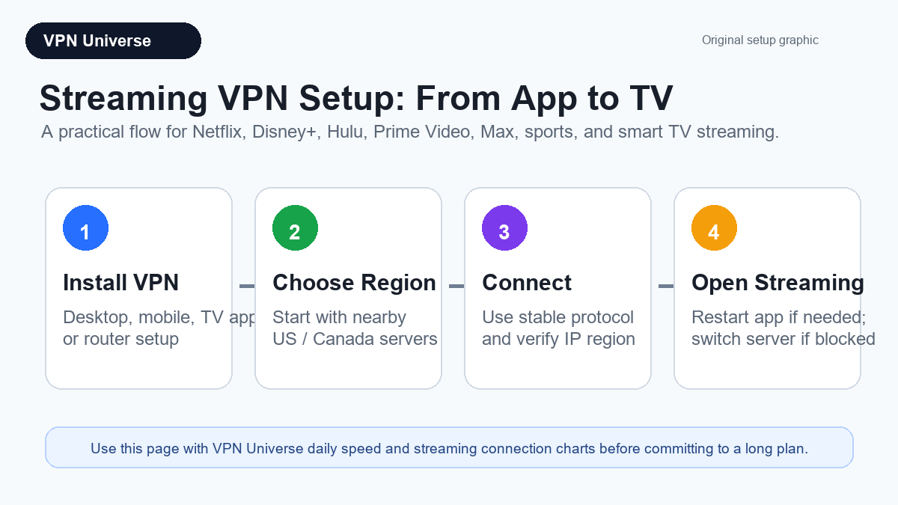
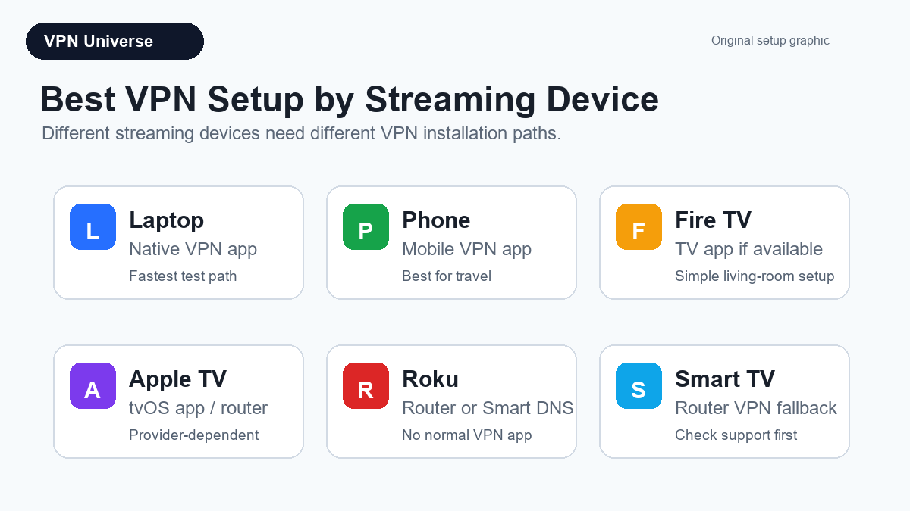
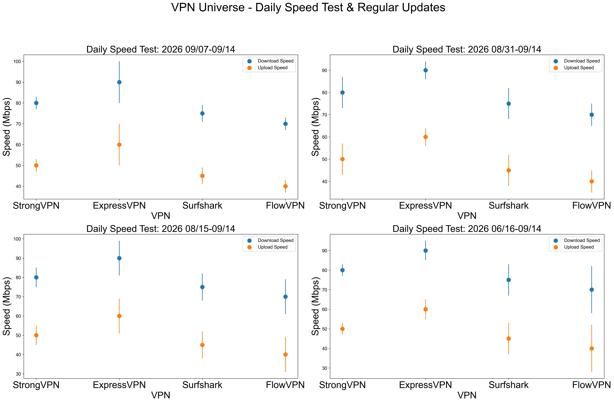
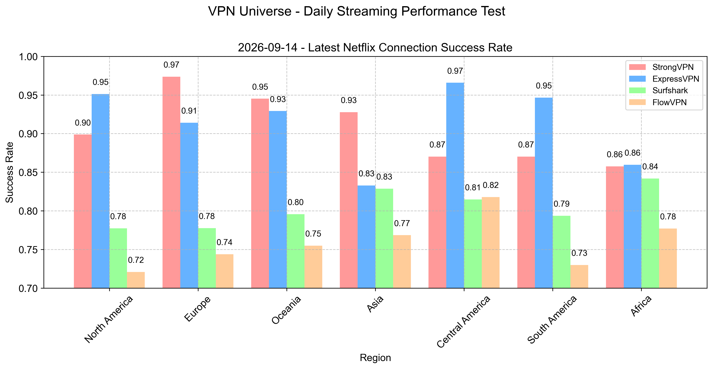
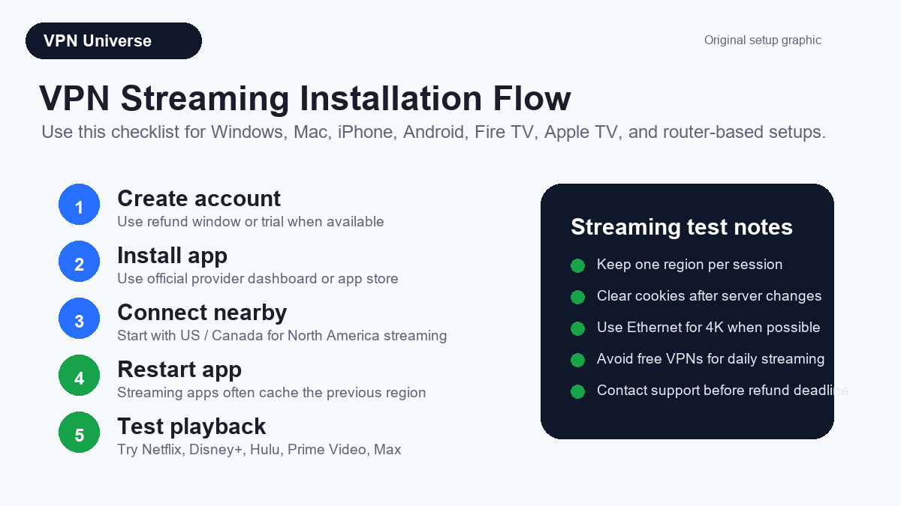
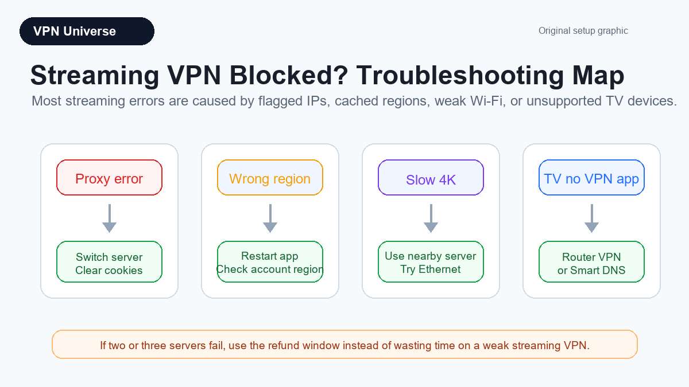

# Best VPN for Streaming 2026 - Netflix, Disney+, Hulu & Daily Speed Tests
**Last updated:** June 3, 2026 - VPN Universe

If you want a VPN mainly for streaming, the question is not just "which VPN is fastest?" A good streaming VPN needs stable speeds, working apps, reliable server switching, and enough consistency for Netflix, Disney+, Hulu, Max, Prime Video, YouTube TV, ESPN+, and other services that frequently block shared VPN IPs.

This page is a focused streaming add-on to the main [VPN Universe comparison](../). It uses the same VPN group, affiliate deals, daily speed chart, and streaming connection charts already tracked by this project.

## Quick Picks for Streaming

| Best For | Pick | Why |
|---|---|---|
| Best premium streaming stability | [ExpressVPN](https://www.expressvpn.com/top/homepage?xvcid=yKMwqFWTfxyKWsB3AWwmhXdXUkpTX-RFKSOyxU0&shareid=&irclickid=yKMwqFWTfxyKWsB3AWwmhXdXUkpTX-RFKSOyxU0&irgwc=1&afsrc=1) | Best fit if you want fewer server changes, polished apps, and strong 4K streaming reliability. |
| Best value streaming VPN | [StrongVPN](https://strongvpn.com/?tr_aid=60d96b5810e50&chan=w_github_en&data1=streaming&data2=table) | Good value if you want a paid VPN for regular streaming without premium pricing. |
| Best for households | [Surfshark](https://surfy-chinaz.com/deals?coupon=surfsharkdeal&transaction_id=102bf6a775238fcbd88327845dfa5b&offer_id=323&affiliate_id=5585&utm_source=Affiliates&utm_medium=5585&utm_campaign=affiliate&recurring_goal_id=312) | Unlimited devices make it practical for families, shared apartments, and multiple TVs. |
| Best short trial | [FlowVPN](https://www.flowvpx.com/sign-up/?locale=en&special=FREETRIAL&r=35-890485.w_github) | Useful if you want to test a VPN before paying for a longer plan. |

## Streaming Platform Cheat Sheet

| Service | Common VPN Problem | What to Try First | Best Starting Pick |
|---|---|---|---|
| Netflix | Proxy error, wrong regional library, video stuck at lower quality | Clear cookies, switch to another nearby server, restart the app | [ExpressVPN](https://www.expressvpn.com/top/homepage?xvcid=yKMwqFWTfxyKWsB3AWwmhXdXUkpTX-RFKSOyxU0&shareid=&irclickid=yKMwqFWTfxyKWsB3AWwmhXdXUkpTX-RFKSOyxU0&irgwc=1&afsrc=1) |
| Disney+ | Login works but playback fails, catalog mismatch, VPN IP blocked | Change US/Canada server, test browser and app separately | [StrongVPN](https://strongvpn.com/?tr_aid=60d96b5810e50&chan=w_github_en&data1=streaming&data2=disney) |
| Hulu | Location error, live TV region mismatch, app cache problem | Use US servers only, clear app storage, reconnect | [ExpressVPN](https://www.expressvpn.com/top/homepage?xvcid=yKMwqFWTfxyKWsB3AWwmhXdXUkpTX-RFKSOyxU0&shareid=&irclickid=yKMwqFWTfxyKWsB3AWwmhXdXUkpTX-RFKSOyxU0&irgwc=1&afsrc=1) |
| Max / Prime Video | App detects VPN or shows local catalog | Try another server in the same country before switching regions | [Surfshark](https://surfy-chinaz.com/deals?coupon=surfsharkdeal&transaction_id=102bf6a775238fcbd88327845dfa5b&offer_id=323&affiliate_id=5585&utm_source=Affiliates&utm_medium=5585&utm_campaign=affiliate&recurring_goal_id=312) |
| ESPN+ / YouTube TV | Sports blackout, local market mismatch, location check | Use the target region consistently and avoid changing locations mid-session | [StrongVPN](https://strongvpn.com/?tr_aid=60d96b5810e50&chan=w_github_en&data1=streaming&data2=sports) |

## Best VPN by Streaming Device

| Device | Best Setup Method | Practical Notes |
|---|---|---|
| Windows / macOS laptop | Native VPN app | Easiest way to test Netflix, Hulu, Disney+, and Prime Video quickly. |
| iPhone / Android | Native mobile app | Good for travel and hotel Wi-Fi; restart the streaming app after changing VPN servers. |
| Fire TV / Fire Stick | Install VPN app from the Amazon Appstore when available | Prefer providers with a real Fire TV app. If the app is not available, router setup may be required. |
| Apple TV | Native tvOS app if available, or router/Smart DNS setup | tvOS support is improving, but older Apple TV setups may still require router-level configuration. |
| Roku / Chromecast / game consoles | Router VPN or Smart DNS | These devices usually do not support normal VPN apps directly. |
| Smart TV | Native app if supported, otherwise router VPN | Check support before buying; many Smart TVs cannot install standard VPN apps. |

## Daily Streaming VPN Speed Chart

For streaming, raw peak speed is less important than consistency. HD video normally needs far less bandwidth than a speed test number suggests, but unstable VPN routes can still cause buffering, login errors, and repeated server switching.

## Overall Streaming Connection Chart

This combined chart gives a quick view of connection success patterns across the VPNs tracked by VPN Universe. Use it as a directional signal, then verify with your own target platform before committing to a long plan.

## Netflix and Disney+ Connection Checks

Streaming platforms can block VPN IPs, rotate restrictions, or show different libraries depending on region. These charts are generated from the VPN Universe automation and should be read as practical connection checks, not a permanent guarantee that any one server will always work.

### Netflix Connection Success

### Disney+ Connection Success

## Streaming Service Fit

| Streaming Need | What Matters | Recommended Starting Point |
|---|---|---|
| Netflix US / Canada | Fast nearby servers, quick IP rotation, app reliability | [ExpressVPN](https://www.expressvpn.com/top/homepage?xvcid=yKMwqFWTfxyKWsB3AWwmhXdXUkpTX-RFKSOyxU0&shareid=&irclickid=yKMwqFWTfxyKWsB3AWwmhXdXUkpTX-RFKSOyxU0&irgwc=1&afsrc=1) or [StrongVPN](https://strongvpn.com/?tr_aid=60d96b5810e50&chan=w_github_en&data1=streaming&data2=netflix) |
| Disney+ / Hulu bundle | US server quality, stable login sessions, easy server switching | [ExpressVPN](https://www.expressvpn.com/top/homepage?xvcid=yKMwqFWTfxyKWsB3AWwmhXdXUkpTX-RFKSOyxU0&shareid=&irclickid=yKMwqFWTfxyKWsB3AWwmhXdXUkpTX-RFKSOyxU0&irgwc=1&afsrc=1) |
| Family streaming devices | Multiple simultaneous devices, simple apps, predictable pricing | [Surfshark](https://surfy-chinaz.com/deals?coupon=surfsharkdeal&transaction_id=102bf6a775238fcbd88327845dfa5b&offer_id=323&affiliate_id=5585&utm_source=Affiliates&utm_medium=5585&utm_campaign=affiliate&recurring_goal_id=312) |
| Test before buying | Short trial, quick setup, no long commitment | [FlowVPN](https://www.flowvpx.com/sign-up/?locale=en&special=FREETRIAL&r=35-890485.w_github) |
| Public Wi-Fi streaming | Encryption, kill switch, stable apps | [StrongVPN](https://strongvpn.com/?tr_aid=60d96b5810e50&chan=w_github_en&data1=streaming&data2=wifi) or [ExpressVPN](https://www.expressvpn.com/top/homepage?xvcid=yKMwqFWTfxyKWsB3AWwmhXdXUkpTX-RFKSOyxU0&shareid=&irclickid=yKMwqFWTfxyKWsB3AWwmhXdXUkpTX-RFKSOyxU0&irgwc=1&afsrc=1) |

## How to Choose a VPN for Streaming

### 1. Start With App Quality

For streaming, app quality matters more than a theoretical server count. A VPN that connects quickly, switches servers cleanly, and works on Fire TV, Apple TV, routers, Windows, macOS, iOS, and Android is easier to use than a faster VPN that constantly needs manual fixes.

### 2. Prefer Paid VPNs Over Free VPNs

Free VPNs are usually poor streaming tools. They tend to have small server pools, overloaded IPs, data caps, slow speeds, and IP addresses already blocked by major platforms. If you only need a one-time test, a free tool may be enough. For regular Netflix, Disney+, Hulu, Max, Prime Video, or sports streaming, paid VPNs are normally the practical choice.

### 3. Use Nearby Servers First

For US and Canada streaming, start with a nearby US or Canadian server before trying distant regions. Nearby servers usually reduce latency and buffering. If a streaming app blocks one server, switch to another nearby location before changing countries.

### 4. Check Router and TV Support

Many streaming problems happen because the VPN works on a laptop but not on a smart TV. If you watch on Apple TV, Fire TV, Roku, Chromecast, game consoles, or a router, check app and setup support before buying.

### 5. Check Refund Terms Before Testing

Streaming access changes. A VPN can work today and need a different server tomorrow. For that reason, refund policy and trial options matter. Test your actual devices, your own streaming accounts, and your target services during the refund window.

## Recommended Streaming Setup

1. Pick a VPN with a refund policy or trial.
2. Install the app on your main streaming device.
3. Connect to a nearby US or Canada server.
4. Test Netflix, Disney+, Hulu, Max, Prime Video, or your target service.
5. If blocked, switch to another server in the same region.
6. If the VPN still fails, contact support or use the refund window.

## Installation Guides by Device

### Windows or Mac

1. Choose a VPN and create an account.
2. Download the official desktop app from the provider dashboard.
3. Sign in and choose a nearby US or Canada server.
4. Open Netflix, Disney+, Hulu, Prime Video, Max, or YouTube TV in a fresh browser window.
5. If the service detects the VPN, clear cookies or switch to another nearby server.

Recommended starting links: [ExpressVPN](https://www.expressvpn.com/top/homepage?xvcid=yKMwqFWTfxyKWsB3AWwmhXdXUkpTX-RFKSOyxU0&shareid=&irclickid=yKMwqFWTfxyKWsB3AWwmhXdXUkpTX-RFKSOyxU0&irgwc=1&afsrc=1), [StrongVPN](https://strongvpn.com/?tr_aid=60d96b5810e50&chan=w_github_en&data1=streaming&data2=windows-mac), [Surfshark](https://surfy-chinaz.com/deals?coupon=surfsharkdeal&transaction_id=102bf6a775238fcbd88327845dfa5b&offer_id=323&affiliate_id=5585&utm_source=Affiliates&utm_medium=5585&utm_campaign=affiliate&recurring_goal_id=312).

### iPhone or Android

1. Install the VPN app from the official app store.
2. Log in and connect to a nearby streaming region.
3. Force close the streaming app, then reopen it after the VPN is connected.
4. If the app still shows the wrong region, clear app cache or reinstall the streaming app.

This setup is useful for hotel Wi-Fi, airports, public Wi-Fi, and travel streaming.

### Fire TV or Fire Stick

1. Search for the VPN app in the Amazon Appstore.
2. Install, sign in, and connect before opening the streaming app.
3. If streaming fails, restart the Fire TV device and try another server.
4. If the VPN app is not available, use router VPN setup instead.

Fire TV is one of the most practical streaming VPN devices because many major VPNs support native apps.

### Apple TV

1. Check whether your VPN provides a native tvOS app.
2. If a native app is available, install it from the App Store and connect before streaming.
3. If not, use router VPN setup or Smart DNS if the provider supports it.
4. Test Netflix, Disney+, Hulu, and Prime Video separately because each platform can behave differently.

Apple TV setup is more provider-dependent than desktop or mobile setup. Verify compatibility before committing to a long plan.

### Router, Roku, Chromecast, and Game Consoles

1. Use a VPN-compatible router or travel router.
2. Install the VPN profile or app at router level.
3. Connect Roku, Chromecast, PlayStation, Xbox, or smart TV to that router network.
4. Test one streaming service at a time and avoid switching countries repeatedly in the same session.

Router setup is useful when your device cannot install VPN apps directly, but it is more technical and can reduce speed if the router hardware is weak.

## Troubleshooting Streaming VPN Blocks

| Problem | Likely Cause | Fix |
|---|---|---|
| Netflix says you are using a proxy | The VPN IP is flagged | Switch servers, clear cookies, restart browser/app |
| Disney+ logs in but video will not play | Region or cached app data mismatch | Change server, clear app cache, test browser and app separately |
| Hulu says location is unavailable | Hulu expects a US location | Use US servers only and avoid mobile GPS mismatch |
| Slow 4K playback | Server congestion, Wi-Fi issue, weak router | Try WireGuard/Lightway if available, move closer to router, use Ethernet |
| Smart TV has no VPN app | Device does not support VPN apps | Use router VPN or Smart DNS |
| Works on phone but not TV | TV app has cached region or uses different DNS | Restart TV, clear app data, test router setup |

## FAQ

### What is the best VPN for streaming in 2026?

For premium stability, start with [ExpressVPN](https://www.expressvpn.com/top/homepage?xvcid=yKMwqFWTfxyKWsB3AWwmhXdXUkpTX-RFKSOyxU0&shareid=&irclickid=yKMwqFWTfxyKWsB3AWwmhXdXUkpTX-RFKSOyxU0&irgwc=1&afsrc=1). For value, start with [StrongVPN](https://strongvpn.com/?tr_aid=60d96b5810e50&chan=w_github_en&data1=streaming&data2=faq). For multiple devices, [Surfshark](https://surfy-chinaz.com/deals?coupon=surfsharkdeal&transaction_id=102bf6a775238fcbd88327845dfa5b&offer_id=323&affiliate_id=5585&utm_source=Affiliates&utm_medium=5585&utm_campaign=affiliate&recurring_goal_id=312) is often the more practical household option.

### Can a VPN guarantee Netflix or Disney+ access?

No. Streaming platforms can block VPN servers at any time. A good VPN improves your odds by maintaining more servers, refreshing IPs, and offering support, but no VPN should be treated as a permanent guarantee for every service.

### Is a VPN legal for streaming?

In the US and Canada, using a VPN is generally legal. However, streaming platforms may restrict VPN use in their terms or block VPN IPs for licensing reasons. Use a VPN responsibly and follow the service rules where applicable.

### Is this page for China VPN users?

No. VPN Universe is primarily a North America and global VPN comparison site. This streaming page is written for users who care about streaming access, public Wi-Fi privacy, household devices, and everyday VPN reliability.

## Bottom Line

If streaming is your priority, choose based on stability, app quality, device support, and refund flexibility. Start with [ExpressVPN](https://www.expressvpn.com/top/homepage?xvcid=yKMwqFWTfxyKWsB3AWwmhXdXUkpTX-RFKSOyxU0&shareid=&irclickid=yKMwqFWTfxyKWsB3AWwmhXdXUkpTX-RFKSOyxU0&irgwc=1&afsrc=1) for premium reliability, [StrongVPN](https://strongvpn.com/?tr_aid=60d96b5810e50&chan=w_github_en&data1=streaming&data2=bottom) for value, [Surfshark](https://surfy-chinaz.com/deals?coupon=surfsharkdeal&transaction_id=102bf6a775238fcbd88327845dfa5b&offer_id=323&affiliate_id=5585&utm_source=Affiliates&utm_medium=5585&utm_campaign=affiliate&recurring_goal_id=312) for multiple devices, or [FlowVPN](https://www.flowvpx.com/sign-up/?locale=en&special=FREETRIAL&r=35-890485.w_github) if you want a short test before buying.

Return to the main [VPN Universe daily VPN comparison](../).
